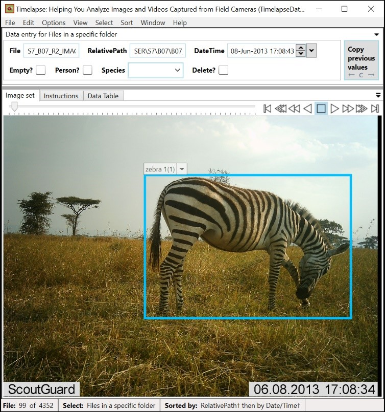

## MegaDetector batch processing workflow integration

This folder contains information about ways to use MegaDetector output files in various workflows.  Specifically...

### Timelapse

[Timelapse](http://saul.cpsc.ucalgary.ca/timelapse/) can read the results produced by the [MegaDetector batch processing API](https://github.com/agentmorris/MegaDetector/tree/main/api/batch_processing) and/or [run_tf_detector_batch.py](https://github.com/agentmorris/MegaDetector/blob/main/detection/run_tf_detector_batch.py), as well as the species classification results produced by our [classification pipeline](https://github.com/agentmorris/MegaDetector/tree/main/classification).  This is how most users work with MegaDetector results.  For information about how to work with MegaDetector results in Timelapse, see [timelapse.md](timelapse.md), but mostly see the [Timelapse Image Recognition Guide](https://saul.cpsc.ucalgary.ca/timelapse/pmwiki.php?n=Main.ImageRecognition).

### eMammal

A [standalone application](https://github.com/agentmorris/MegaDetector/tree/main/api/batch_processing/integration/eMammal) is available to transfer MegaDetector results from our .json results format into the [eMammal desktop client](https://emammal.si.edu/eyes-wildlife/content/downloading-desktop-application).  Many eMammal users also work with our results by splitting images into separate folders for animal/empty/vehicle/person using [this script](https://github.com/agentmorris/MegaDetector/blob/main/api/batch_processing/postprocessing/separate_detections_into_folders.py), then either discarding the blanks or creating separate deployments for animal/empty/human.

### digiKam

[Python tools](digiKam/README.md) (which can be run with a GUI) to transfer MegaDetector results from our .json results format into XMP image metadata, specifically for use with [digiKam](https://www.digikam.org/).

### The other 999999 tools in the universe

Although most users read MegaDetector results directly into Timelapse, lots of users working with other systems run MegaDetector, then use, for example, [separate_detections_into_folders.py](https://github.com/agentmorris/MegaDetector/blob/main/api/batch_processing/postprocessing/separate_detections_into_folders.py) to move blank, human, and animal images into separate folders, where they may be processed differently.  For example, many users upload the animals to a citizen science platform for volunteer review, have internal staff review the human images, and do limited additional processing with the blank images.

### Data preparation

For any of these use cases, you may also want to check out our [Camera Trap JSON Manager App](https://github.com/agentmorris/MegaDetector/blob/main/api/batch_processing/postprocessing/CameraTrapJsonManagerApp.md), which can help you split/modify our .json results files to break into smaller projects, adjust relative paths, etc.

If you use any of these tools &ndash; or if we're missing an important one &ndash; <a href="mailto:cameratraps@lila.science">email us</a>!

