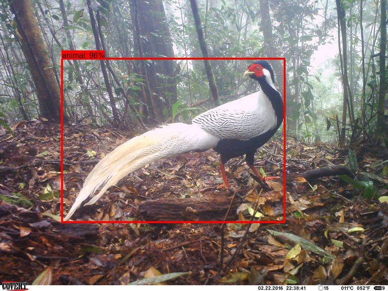

# Overview

Most of the scripts in this folder create or manipulate COCO Camera Traps databases, i.e. .json files in the [COCO Camera Traps format](#coco-camera-traps-format).

# Contents

## Scripts in this folder

* [cct_json_utils.py](cct_json_utils.py) contains utilities for working with COCO Camera Traps .json databases
* [cct_to_wi.py](cct_to_wi.py) converts a COCO Camera Traps .json file to the [Wildlife Insights batch upload format](https://github.com/ConservationInternational/Wildlife-Insights----Data-Migration)
* [coco_to_yolo.py](coco_to_yolo.py) converts a COCO-formatted dataset to a YOLO-formatted dataset.
* [generate_crops_from_cct.py](generate_crops_from_cct.py) creates a cropped image for each bounding box in a CCT .json file
* [get_image_sizes.py](get_image_sizes.py) retrieves the image size for every image in a json-formatted list of filenames
* [read_exif.py](read_exif.py) reads EXIF/IPTC/XMP fields from all images in a folder, writing all that metadata to .json/.csv
* [remove_exif.py](remove_exif.py) removes EXIF/IPTC/XMP metadata from a folder of images
* [yolo_output_to_md_output.py](yolo_output_to_md_output.py) converts the output of YOLOv5's detect.py and val.py to the MD batch output format
* [yolo_to_coco.py](yolo_to_coco.py) converts a YOLO-formatted dataset to a COCO-formatted dataset.  Supports flat folders only.

## annotations

The only file in this folder is `annotation_constants.py`, which defines a set of shared constants mapping class IDs to categories.

## databases

Miscellaneous tools for manipulating COCO Camera Traps .json files.  Of particular note is `integrity_check_json_db.py`, which validates that a CCT database is well-formatted, optionally checking image existence and size.

## lila

Scripts for preparing data for upload to [LILA](https://lila.science), and working with LILA index files.

## importers

Code for converting frequently-used metadata formats (or sometimes one-off data sets) to COCO Camera Traps .json files.

# COCO Camera Traps format

The COCO Camera Traps (CCT) format (used for camera trap data on [LILA](https://lila.science)) and for some intermediate processing by other scripts in this repo is an extension of the [COCO format](https://docs.aws.amazon.com/rekognition/latest/customlabels-dg/md-coco-overview.html) to add fields that are relevant for camera trap data. CCT is a superset of COCO, so CCT datasets are compatible with tools that expect COCO-formatted data.


```
{
  "info" : info,
  "images" : [image],
  "categories" : [category],
  "annotations" : [annotation]
}

info 
{
  ## Required ##

  "version" : str,
  "description" : str,
  
  ## Optional ##

  "year" : int,
  "contributor" : str
  "date_created" : datetime
}

image
{
  ## Required ##

  "id" : str,
  "file_name" : str,
  
  ## Optional ##

  "width" : int,
  "height" : int,
  "rights_holder" : str,    

  # Precise date formats have varied a little across datasets, the spirit is
  # "any obvious format that dateutil knows how to parse".  Going forward,
  # we are using Python's standard string representation for datetimes, which
  # looks like: 
  #
  # 2022-12-31 09:52:50
  "datetime": datetime,  

  # A unique identifier for the sequence (aka burst, episode, or event) to 
  # which this image belongs
  "seq_id": str,

  # The total number of images in this event
  "seq_num_frames": int,

  # The zero-indexed index of this image within this event
  "frame_num": int
  
  # This is an int in older data sets, but convention is now strings
  "location": str,
  
  # Image corruption is quite common in camera trap images, and throwing out corrupt
  # images in database assembly is "dodging part of the problem".  Wherever possible,
  # use this flag to indicate that an image failed to load, e.g. in PIL and/or TensorFlow.
  "corrupt": bool
}

category
{
  ## Required ##
  
  # Category ID 0 reserved for the class "empty"; all other categories vary by data
  # set.  Non-negative integers only.
  "id" : int,

  # Can be any string, but if the category indicates empty, the standard is "empty"
  # (as opposed to "blank", "false trigger", "none", "misfire", etc.). 
  #
  # Lower-case names without spaces are encouraged, but not required.  I.e., all other
  # things being equal, use "gray_wolf" rather than "Gray Wolf".
  "name" : str  
}

annotation
{
  ## Required ##

  "id" : str,
  "image_id" : str,  
  "category_id" : int,
  
  ## Optional ##
  
  # These are in absolute, floating-point coordinates, with the origin at the upper-left
  "bbox": [x,y,width,height],
  
  # This indicates that this annotation is really applied at the *sequence* level,
  # and may not be reliable at the individual-image level.  Since the *sequences* are
  # the "atom of interest" for most ecology applications, this is common.
  "sequence_level_annotation" : bool
}
```

Note that the coordinates in the `bbox` field are absolute here, different from those in the [MegaDetector results format](api/batch_processing/README.md#megadetector-batch-output-format), which are normalized.

Fields listed as "optional" are intended to standardize commonly-used parameters (such as date/time information).  When present, fields should follow the above conventions.  Additional fields may be present for specific data sets.

# Gratuitous animal picture

<br/>Image credit Saola Working Group, from the [SWG Camera Traps](https://lila.science/datasets/swg-camera-traps/) data set.

