# New model family released: MegaDetector v1000

Release notes, July 2025

## Contents

* [tl;dr](#tldr)
* [Three years with MDv5: a quick recap](#three-years-with-mdv5-a-quick-recap)
    * [June 2022: MDv4 is still a thing, MDv5 released](#june-2022-mdv4-is-still-a-thing-mdv5-released)
    * [Ecosystem explosion!](#ecosystem-explosion)
    * [Inference jobs... I get to play with MD too!](#inference-jobs-i-get-to-play-with-md-too)
    * [MD starts to show up in the literature as a *tool*, not a *topic*](#md-starts-to-show-up-in-the-literature-as-a-tool-not-a-topic)
    * [Weak spots emerge](#weak-spots-emerge)
      * [Boxes in the sky](#boxes-in-the-sky)
      * [Reptiles](#reptiles)
      * [Weak spots I didn't know we had until I started fixing the others](#weak-spots-i-didnt-know-we-had-until-i-started-fixing-the-others)
      * [Stuff I didn't manage to fix this time around](#stuff-i-didnt-manage-to-fix-this-time-around)
* [Toward a new training dataset](#toward-a-new-training-dataset)
  * [Fixing data and annotating new data](#fixing-data-and-annotating-new-data)
  * [Filling gaps, especially reptiles](#filling-gaps-especially-reptiles)
* [Pre-training](#pre-training)
* [Introducing MDv1000](#introducing-mdv1000)
  * [Why so many models?](#why-so-many-models)
  * [Which model should I use?](#which-model-should-i-use)
  * [Confidence value considerations when comparing to MDv5 (or other models)](#confidence-value-considerations-when-comparing-to-mdv5-or-other-models)
  * [Why "MDv1000"?](#why-mdv1000)
* [(Formally) introducing the MD Python package](#formally-introducing-the-md-python-package)
  * [Running MD with the MD Python package](#running-md-with-the-md-python-package)
  * [Postprocessing with the MD Python package](#postprocessing-with-the-md-python-package)
  * [Other utilities: the business of doing camera trap stuff](#other-utilities-the-business-of-doing-camera-trap-stuff)
* [What's next?](#whats-next)
  * [Short-term: back to the data workshop... and SpeciesNet!](#short-term-back-to-the-data-workshop-and-speciesnet)
  * [Long-term: toward a "community MegaDetector"](#long-term-toward-a-community-megadetector)
* [What do LLMs mean for the future of camera trap AI?](#what-do-llms-mean-for-the-future-of-camera-trap-ai)
* [Acknowledgments](#acknowledgments)

## tl;dr

This is going to be more like a blog post than release notes, so, I'm getting to the punchline first... this release includes five new MegaDetector models, one the same size as MDv5 and <i>probably</i> a bit more accurate, the others - to varying degrees - faster and <i>probably</i> a bit less accurate.

The most important question: do you need to "upgrade"?  IMO no, **no one should rush to "upgrade" their workflows** to use these new models.  I consider this an incremental release that does not add any fundamentally new capabilities: these models are still object detectors with categories "animal", "person", and "vehicle".  While it's nice to have more choices, in many cases the time it would take you to adjust, e.g., confidence thresholds in your workflow is better spent optimizing your workflow in other ways.  In a world where what all we're trying to do as AI practitioners is make ecologists as efficient as they can be, sometimes learning a new keyboard shortcut, or switching away from an Excel-based workflow, might be way more important than upgrading to the fanciest model.

That said, I am excited about this release!  I just have a tendency toward being conservative in workflow changes, and AI is just one tiny piece of the life cycle of an image-based wildlife survey.

With that out of the way, if you want to get right to the download links, visit the "[introducing MDv1000](#introducing-mdv1000)" section.  Otherwise, join me on what will be more like a blog post about the last few years of MDv5 than release notes for the new models, although I promise, we'll get to the new models.

## Three years with MDv5: a quick recap

As per above, I'm using this release notes page as an opportunity to talk about some of the highlights of the ~three years since the MDv5 release, building up to present-day and the MDv1000 release.  So hop in your time machine and jump back to June 2022...

### June 2022: MDv4 is still a thing, MDv5 released

I may have mentioned earlier that I'm very conservative about recommending changes, and even though now in retrospect we can say that MDv5 is oodles better than MDv4, if you're comparing two models, and you look hard enough, you'll always find a *few* animals that the "worse" model finds but the "better" model misses, and those made me paranoid.  So for about three months of day-to-day image handling (or around 250M images), I ran both models on everything until I convinced myself that MDv5 was really better, like the validation numbers said.  We also initially had four checkpoints we were comparing to decide which would become MDv5, and it took a lot of comparison to get them down to the two that we eventually released (which became MDv5a and MDv5b).

At the time, the ecosystem for running MDv4 was pretty limited, and the size of the model and sometimes frustrating behavior of some of the dependencies made it a little hard to run.  Consequently, I estimate that at the time of the MDv5 launch, 90% of MD processing (by number of images) still ran through me.  I.e., the ~100M images per year that I was running were probably 90% of MD use in early 2022.  As much as I love doing stuff with pictures of animals, that's not a healthy ecosystem.

Spoiler alert: the number of images I process for users has remained pretty constant at around 100M/year, but my best estimate is that this is now more like 10% of MD use, which means the overwhelming majority of inference has moved out into the community.  Success!  More on this later.

### Ecosystem explosion!

(I mean in the software sense, not in the sense of wild places literally exploding.)

The most important development in MegaDetector-land since the MDv5 release - in fact since the MDv4 release - is not about MegaDetector, it's about the ecosystem of tools for running MD and working with MD results that emerged starting in mid-2022.

As I mentioned above, there were relatively limited ways to run MD before 2022.  It was pretty much "Python CLI or bust", which in most cases meant sending them off someone who speaks Python.  But over the next couple of years, other tools emerged that fit MD into a variety of workflows, making it accessible to a much wider audience.  On the cloud side, users can now access MD (sometimes without knowing it... in a good way!) through a host of platforms targeting different workflows and different user profiles: [Wildlife Insights](https://www.wildlifeinsights.org/), [TrapTagger](https://wildeyeconservation.org/traptagger/), [WildTrax](https://wildtrax.ca/), [Agouti](https://agouti.eu/), [TRAPPER](https://trapper-project.readthedocs.io/en/latest/overview.html), [wpsWatch](https://wildlabs.net/inventory/products/wpswatch), [Animl](https://animl.camera/), [Zamba Cloud](https://zamba.drivendata.org/), and [Animal Detect](https://www.animaldetect.com/), for example, all let users run MD in the cloud without ever hearing the word "Python".  [DeepFaune](https://www.deepfaune.cnrs.fr/en/), for example, uses MegaDetector in a client-side context.

Based on the signals I can discern from anecdotal interactions and from the literature, most MD use now goes through [AddaxAI](https://addaxdatascience.com/addaxai/) ("EcoAssist" at the time of its release in 2022), a desktop tool for running AI models (not just MD) on camera trap images.  There are lots of reasons to use a cloud platform, but there are also lots of reasons to work locally, and prior to AddaxAI, "working locally" meant "doing Python stuff at the command line".  AddaxAI (combined with the speedup that MDv5 offered relative to MDv4, and the increasing availability of GPUs on typical user machines) *dramatically* lowered the bar for running MD.

Along the same lines, MDv5 would still be just a random AI model on the Internet (or might not have happened at all, i.e. we might have never gone past MDv4) if not for the five-year-plus partnership we've had with [Saul](https://saul.cpsc.ucalgary.ca/) and [Timelapse](https://timelapse.ucalgary.ca/); Saul has been the voice of the user a zillion times in figuring out the best way to bring improvements in tooling to real user workflows, and has continually adapted Timelapse to be an "AI-ready" tool since the MDv5 release.

So, tl;dr, I still run about 100M images per year for users, but now it's a pretty small percentage of MD use overall, which is right where it should be.  I like to handle the difficult cases that move the tools forward, including the cases where MegaDetector doesn't work well, or the cases where it works but requires some special handling or new postprocessing features, or the cases where someone has an intractable backlog of images that they need help digging out of, *after* which they can transition to a self-serve approach.  But the "default" now is "self-serve", which is a huge step forward from 2022!  And that change is due more to the software ecosystem than to the difference between MDv4 and MDv5.

This has been a lot of text without any images, so I'm going to add some gratuitous logos here to double down on the importance of the ecosystem for running AI models:

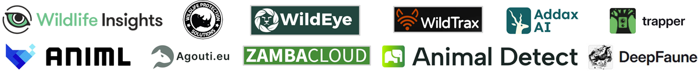 

NB: the list of tools in this section is not comprehensive; I try to keep track of all the platforms that use MD in some way [here](https://github.com/agentmorris/MegaDetector/blob/main/megadetector.md#cloud-based-platforms-that-leverage-megadetector), but let me know if I'm missing things!

### Inference jobs... I get to play with MD too!

As I mentioned above, I process ~100M images per year for users; that number has been pretty constant over the last three years.  This isn't *just* because I like pictures of animals (although it's a lot because I like pictures of animals), it has also let me fine-tune the process for running MD.  Some of that is code for inference and postprocessing, which I'll talk about later when I talk about the [MegaDetector Python package](https://pypi.org/project/megadetector/), but just as important is boring process stuff, including:

* Getting the instructions right to make it as easy as possible to send me images
* The main [script](https://github.com/agentmorris/MegaDetector/blob/main/notebooks/manage_local_batch.py) (really more like a notebook) that I use to run large jobs, and to quickly get a sense of whether MD worked well enough that I should feel good about telling a user to trust MD (and later [SpeciesNet](https://github.com/google/cameratrapai/)), and what confidence threshold I would recommend
* The reporting format and email template I use to explain MD results (and later SpeciesNet results) to users, so they can make as thorough an assessment as possible - given that ground truth is rarely available - as to whether they should trust AI
* Tools for comparing different sets of results when ground truth isn't available, particularly the [compare_batch_results](https://megadetector.readthedocs.io/en/latest/postprocessing.html#module-megadetector.postprocessing.compare_batch_results) module, so that for difficult cases I can make a more informed decision, for example, between MDv5a and MDv5b, or later between MDv5a and MDv1000-redwood (the largest of the new models)
* The ergonomics of the [repeat detection elimination](https://github.com/agentmorris/MegaDetector/tree/main/megadetector/postprocessing/repeat_detection_elimination) process, so that we can often eliminate a few hundred thousand false detections in a large dataset with just a few minutes of human intervention
* Subjectively evaluating the differences between MDv4 and MDv5, and later between MDv5 and MDv1000

Trying to improve all of these things (as well as the core inference and postprocessing code) just a little bit with every job has helped build these best practices into the MegaDetector Python package, and has made it possible to turn most jobs around - whether it's 10k images or 20M images - in just a couple minutes of human time, and most importantly to quickly advise users on whether I would trust AI in the context of their data.  And also to handle the super-complicated cases, e.g. cases where someone wants to know whether two animals got close to each other, or whether a bird approached a mammal, or whether a bird left its nest, etc.  The complicated ones are my favorites!

The other upside of the opportunity I've had to run MD for users: by default I delete the images after processing, but when I see cases where MD doesn't work well, or where a dataset represents a known gap in available training data, I ask for permission to keep it for training, so in addition to looking at pictures of animals, this has been an opportunity to accumulate training data.  Win/win.  More on this later.

### MD starts to show up in the literature as a *tool*, not a *topic*

The first few papers that cited MD were mostly papers <i>about</i> using ML for camera trap data, which are great, but a step short of impact.  2023-2024 saw a dramatic increase in the number of papers that cited MD but weren't *about* ML, they were just ecology papers that mentioned using MD in passing, the same way you would mention using Matlab or Excel.  Those passing mentions are the "goal post" for this kind of work!  Part of the reason it took until 2023 and 2024 is just latency (ecology takes a long time), but a bigger part of it is the ecosystem explosion I mentioned earlier.  I try to keep track of those papers [here](https://agentmorris.github.io/camera-trap-ml-survey/#papers-with-summaries); look for the papers tagged "MegaDetector" <i>and</i> "ecology paper" (meaning that the paper isn't about ML, it's about ecology).  I.e., look for this:

### Weak spots emerge

> &ldquo;With great volume comes great edge cases&rdquo;

&mdash;Me, while writing this markdown file

Running lots of images through MD was a fantastic opportunity to find all the places where annoying stuff happens, sometimes expected things related to gaps in training data, sometimes just "machine learning will drive you bananas" things.  This section highlights some of the major weak points that emerged in the course of running MD over the last few years; I discuss these in more detail [here](https://github.com/agentmorris/MegaDetector/blob/main/megadetector-challenges.md).  

Before I get to the specific issues, maybe a more important point: these issues look obvious here when I choose representative images, but in most cases these issues aren't obvious if you only look at positives, i.e. detections.  That's why it's so so so so important - for any AI model that will be used to avoid manual review, not just MD - to make sure that new users have a systematic way to review a sample of their <i>negatives</i> (to make sure there aren't animals hiding in the "negatives"), and to go into each batch with the assumption that AI is a complete catastrophe, and convince yourself otherwise before trusting AI, or before recommending that a use trust AI.

Now on to the main issues that came up over the last couple of years.  Throughout this section, I'm going to show some examples of issues I observed with MDv5, then a MDv1000 result that looks better.  These are absolutely hand-picked to make a point, so don't read too much into these in terms of how significant the issues are.  I've said since the beginning of this document that MDv5 is still very good, and if anything MDv1000-redwood is only slightly better, and I don't want anyone to walk away from this section thinking "wow, MDv5 is a disaster"; it's not, it's just the nature of what this section is about.  I'm sure that someday I will write a similar section showing glaring issues with MDv1000.  In other words, <b>never trust "random" examples someone puts in a markdown file to make a point</b>.

#### Boxes in the sky

On some images, particularly (but not exclusively) in the [Snapshot Serengeti](https://lila.science/datasets/snapshot-serengeti) dataset, MDv5 would put boxes <i>near</i> animals, but floating in the sky:

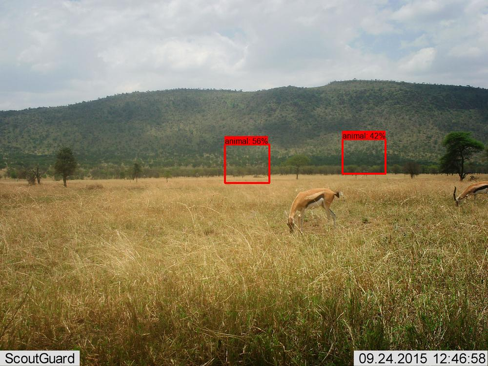

Image credit [Snapshot Serengeti dataset](https://lila.science/datasets/snapshot-serengeti)

Sometimes it would also just output no boxes or very-low-confidence boxes on these images.  I convinced myself this was some kind of insidious bug in the YOLO framework, or something like corrupt metadata, but in fact, Occam's razor correctly predicts the root cause here: there were a bunch of training boxes floating in the sky near animals, instead of <i>on</i> animals, due to some kind of scaling issue that happened during the original annotation.  So MDv5 basically learned the rule "if images have a background that kind of looks like xyz, find the animals, then scale the box locations by a fixed ratio".  Who would have guessed that a model could even learn this!

Despite primarily impacting Snapshot Serengeti data, this is a problem for three reasons:

* There are only so many parameters, even in a large model, and it's hard to say how many parameters MD is devoting to memorizing this preposterous rule.
* It's not *only* on Snapshot Serengeti data, it's on *any images that kind of looks like a handful of specific cameras*, most of which happen to be in Snapshot Serengeti.  It's rare, but I have definitely seen cases where MDv5 put boxes in the sky in unrelated ecosystems, where the sky and the hills looked like the above image, for example.
* The Snapshot Serengeti program and dataset are important.  It's going a bit too far to say that MDv5 is useless for Snapshot Serengeti data, but only a bit.

Spoiler: this is fixed in MDv1000...

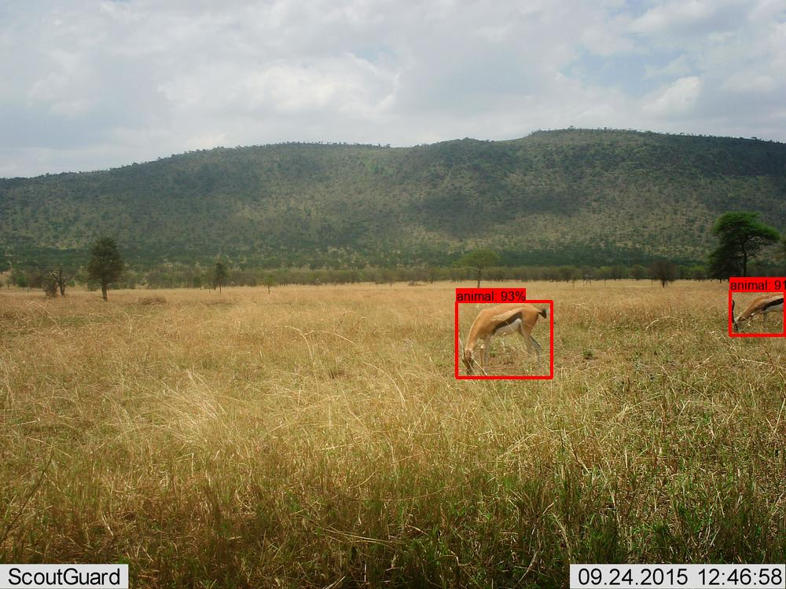

Image credit [Snapshot Serengeti dataset](https://lila.science/datasets/snapshot-serengeti)

#### Reptiles

Reptiles are uncommon in camera traps, because most cameras operate on infrared triggers that depend on heat-producing animals, which, it turns out, reptiles are not, at least not to the degree that mammals and birds are.  Consequently, even easy-to-see reptiles are under-represented in training data, and images like this:

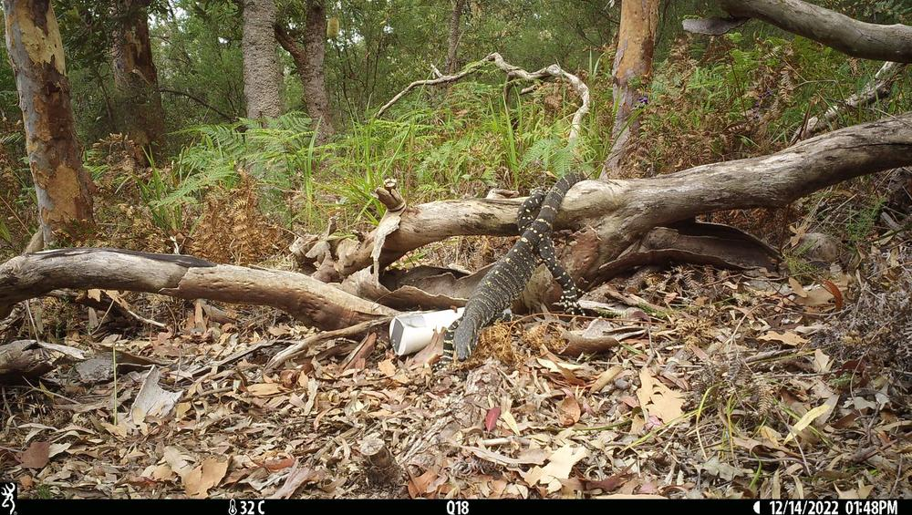

Image credit: [UNSW Predators dataset](https://lila.science/datasets/unsw-predators/)

Spoiler: performance on large reptiles is substantially improved in MDv1000...

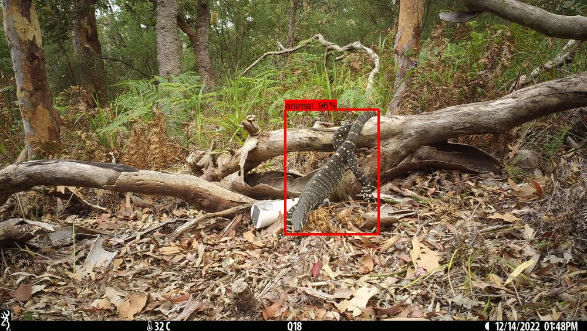

Image credit: [UNSW Predators dataset](https://lila.science/datasets/unsw-predators/)

This improved performance on large reptiles may come the cost of reducing precision on sticks that look like reptile tails; I definitely see more false positives that look like long reptile tails with MDv1000 than I did with MDv5.  But I can live with this, since the use cases I'm focus on tend to favor recall, and sticks tend to be easy to get rid of with [repeat detection elimination](https://github.com/agentmorris/MegaDetector/tree/main/megadetector/postprocessing/repeat_detection_elimination) and, increasingly, with the "blank" class in [SpeciesNet](https://github.com/google/cameratrapai)).

#### Weak spots I didn't know we had until I started fixing the others

Once I started reviewing the images with the shifted/scaled boxes, I found a number of other issues in the MDv5 training data, primarily in the following categories:

* Missing boxes on small birds, particularly at night
* Missing boxes on rodents, particularly in some long runs of images that looked to have been more reliant than expected on MDv4 boxes during annotation
* Images with dozens of animals (typically livestock, sometimes elk or other herd animals) with no boxes, where it appears the annotator's intention was to communicate "this is too hard to label", but the metadata actually says "empty"
* Images with vehicles that were labeled back in the MDv3 days, when there was no vehicle class, but were never relabeled, resulting in de facto false negatives on vehicles (oops!).  There are whole datasets where MDv5 learned *not* to predict vehicles, even on obvious vehicles.
* In a smaller number of cases, images where boxes came from public sources and didn't include people and/or vehicles, and that information got lost somewhere in training.  E.g. the [Caltech Camera Traps](https://lila.science/datasets/caltech-camera-traps) dataset has a number of people, and MDv5 specifically learned to ignore them over specific backgrounds (which is quite amazing!).

All of these were relatively small proportions of the total images, which is why we missed them back in the MDv5 days.  And deep learning is pretty good at rolling with stuff like this, so none of these were as pronounced in MDv5 output as the "boxes in the sky" issue.  But they weren't one-off issues either; each of these was a systematic issue that impacted hundreds to thousands of training images.

Here's an example of one of the issues I mentioned above, where MDv5 missed something obvious that can be traced back to missing boxes on similar training images:

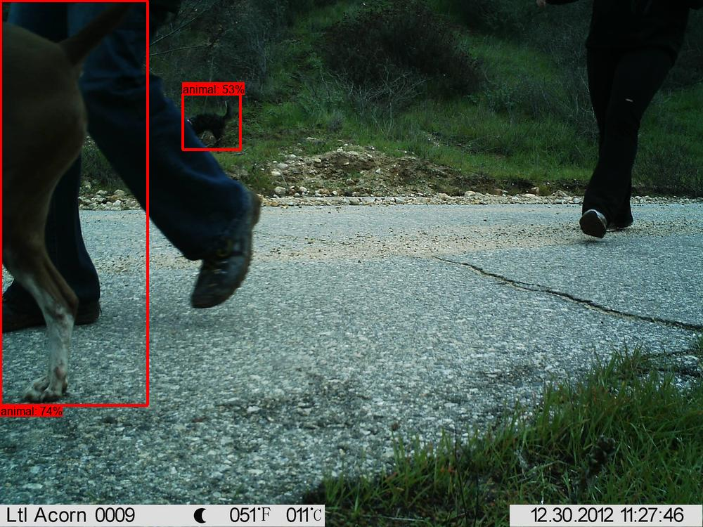

Image credit [Caltech Camera Traps](https://lila.science/datasets/caltech-camera-traps) dataset

The cases that were this "cut and dried" are fixed in MDv1000:

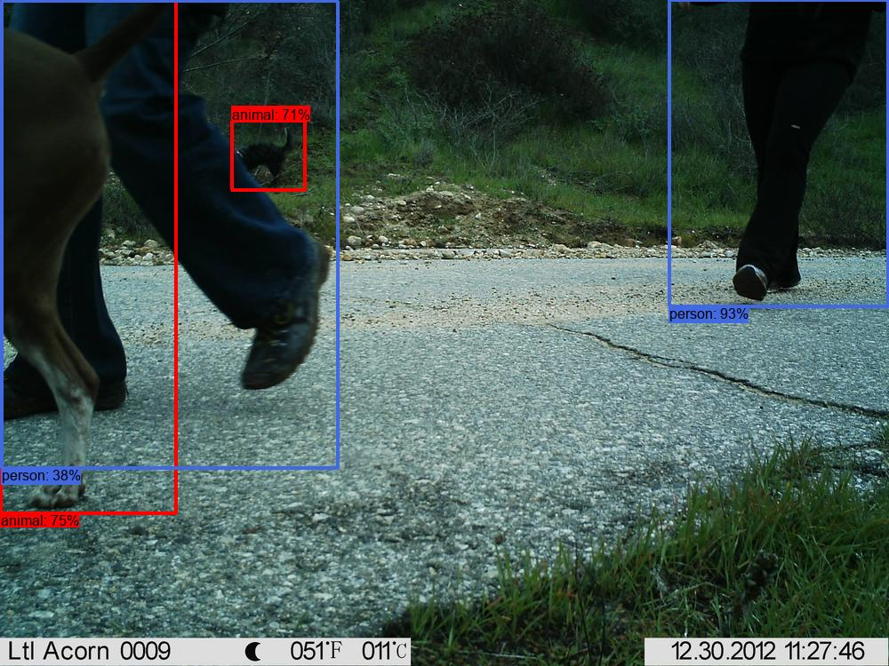

Image credit [Caltech Camera Traps](https://lila.science/datasets/caltech-camera-traps) dataset

Small birds and rodents are always hard, so even though I can point to a zillion boxes that were missing in training on small birds and rodents, it's much harder to point to specific cases where that caused errors, because maybe they would have been missed anyway.  Nonetheless, this image is pretty representative and I'm as sure as I can be that this is specifically related to missing training boxes:

MDv5 says no animal...

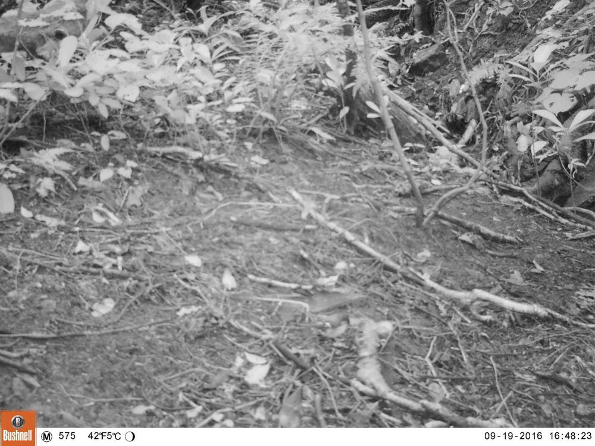

Image credit [Wellington Camera Traps](https://lila.science/datasets/wellingtoncameratraps) dataset

MDv1000 says animal...

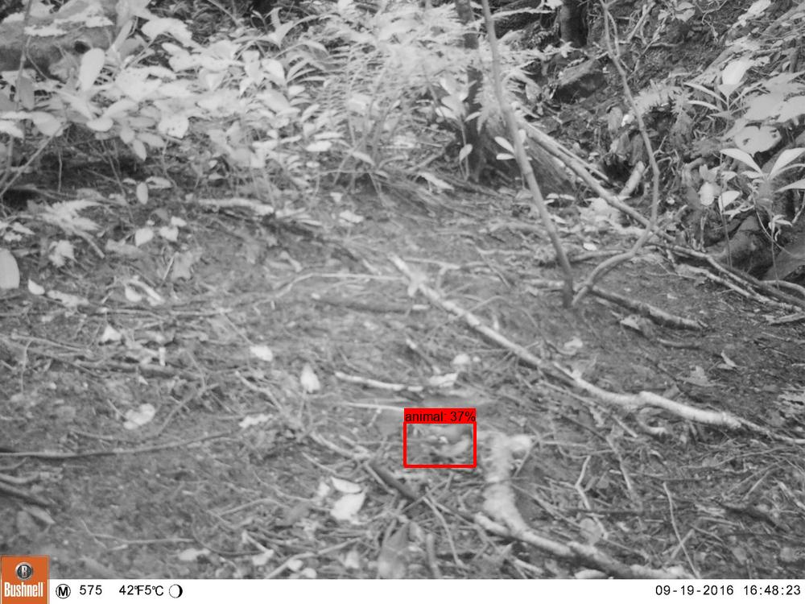

Image credit [Wellington Camera Traps](https://lila.science/datasets/wellingtoncameratraps) dataset

Many cases in this category looked more or less like this, and annotators can be forgiven for missing these!

#### Stuff I didn't work on this time around

This section addressed the issues that I discovered when working with MDv5 and proactively worked on for MDv1000; in the interest of completeness, there are other issues I found and didn't try that hard to fix (and therefore didn't fix, i.e. these issues are still present in MDv1000):

* [Semi-aquatic mammals sticking out of the water](https://github.com/agentmorris/MegaDetector/blob/main/megadetector-challenges.md#aquatic-mammals-with-their-adorable-heads-just-peeking-out-of-the-water)
* [Fluffy mountain goats](https://github.com/agentmorris/MegaDetector/blob/main/megadetector-challenges.md#random-ai-failures-that-have-not-been-fixed)

## Toward a new training dataset

For the above issues, the only fix is training data; no amount of fancy postprocessing can erase the fact that MDv5 learned some wild rules about putting boxes in the sky in the context of certain backgrounds, or ignoring vehicles in the context of certain backgrounds.

So, I assembled a training dataset containing:

* The public (i.e., LILA) subset of the MDv5 training data (which is [here](https://lila.science/megadetector-results-for-camera-trap-datasets/#md-training-info)).  This is somewhere around "a little more than half" of the MDv5 training data, depending on how you count, including images that became public after the MDv5 release.
* Images used in MDv5's training data that data owners sent me later (which I still can't release publicly).
* New images, not used in MDv5 training (some of which I still can't release publicly, but some of which have become available on LILA).

Overall the dataset is a little larger than the MDv5 training set, and overlaps a lot, but is not a strict superset.  There are still images I don't have access to from the original training data, and there are a number of images that I dropped during the re-annotation process when I observed significant issues and the cost of fixing them outweighed the benefit.

For this round, I prioritized comparability to MDv5, which meant respecting MDv5's train/val split on the images that exist in both training datasets.  This turned out to be a huge hassle that I probably won't do again, but this time I prioritized comparison to MDv5 to the degree that it was possible.

### Fixing data and annotating new data

That's all well and good, but I just told you about a bunch of broken training boxes, and a bunch of new images in need of training boxes.  To do anything with that information, I needed a set of tools for both creating and adjusting annotations.  Fortunately, we have something this time that we didn't have at the time MDv5 was created... MDv5!  Consequently, a significant amount of time during this training cycle went into improving my tools for adding or repairing boxes with lots of help from MDv5.  This wasn't about fancy infrastructure, rather it was about getting the right optimizations and keyboard shortcuts in place so that when I'm powering through images where either ground truth or MDv5 are mostly right, I should be moving through several images per second without using the mouse.  Specifically:

1. When boxes are available, I should be able to confirm them as fast as I can press the page-down key.  When there's a problem (e.g. a missed animal), I should be able to call up MDv5 results at a variety of confidence thresholds with a single keystroke.
2. When boxes are not available, I should be able to start with MDv5 results and press only a single key on each image where MDv5 is correct.  When MDv5 isn't correct, I should be able to call up alternative MDv5 thresholds, and reach for the mouse only as a last resort.
3. When boxes are close but not quite right, I should be able to adjust them without touching the mouse.

This led me to [fork the Labelme annotation tool](https://github.com/agentmorris/labelme), to build a workflow that is tied to this extremely niche task, with strong assumptions about the distribution of objects that appear in camera trap images.  I.e., this fork is not a good interface for general bounding box annotation, it implicitly assumes a lot of things about the typical number and size of animals in camera trap images, and the typical accuracy of MDv5.  But for this task, it's very efficient!

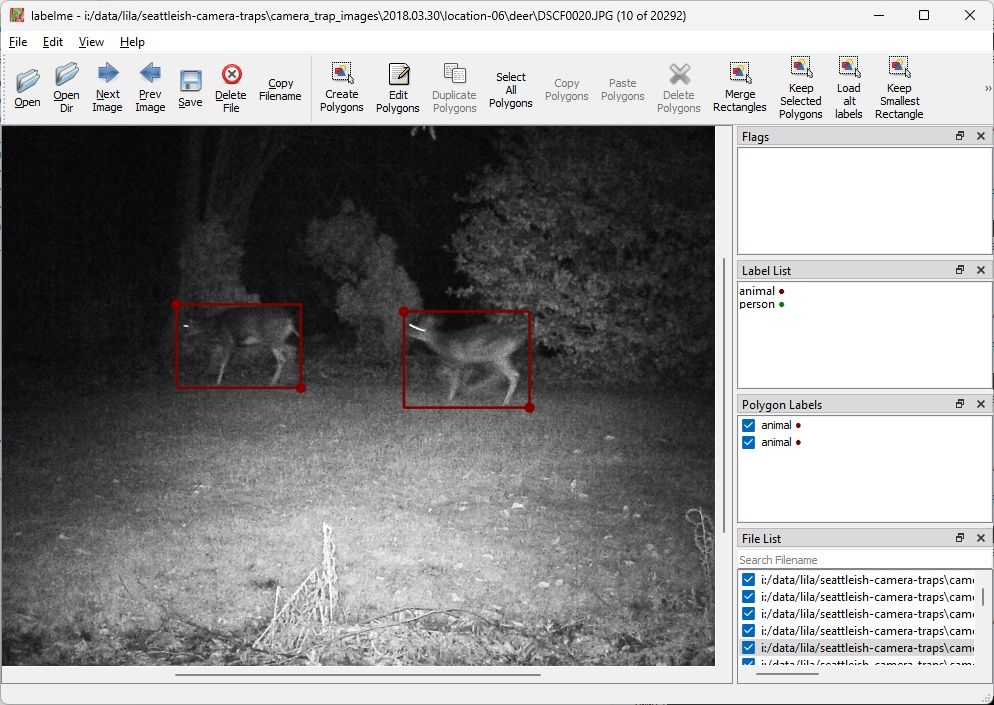

When starting from MD results, I create labelme-formatted files using the [md_to_labelme](https://megadetector.readthedocs.io/en/latest/postprocessing.html#module-megadetector.postprocessing.md_to_labelme) module in the [MegaDetector Python package](https://pypi.org/project/megadetector/).  One pro tip is that when starting with MD results, this goes <i>much</i> better after aggressive [repeat detection elimination](https://github.com/agentmorris/MegaDetector/tree/main/megadetector/postprocessing/repeat_detection_elimination), since every false positive you have to manually delete costs you two keystrokes.

For anyone who wants to try to pick up this workflow, it's not slickly packaged, but I found it to be effective, so, <a href="mailto:agentmorris@gmail.com">ping me</a>!

Sidebar: when you generate candidate boxes with one detector (in this case MDv5), even though every image is manually reviewed, training data will implicitly take on some properties of the weak labeler: there's always a range of pixels that might represent, e.g., the "top" of the box, and the whole point of this workflow is that we auto-accept the recommended label at least 99% of the time (in fact, if I've got all the thresholds right, most of what I'm doing is *deleting* boxes).  Consequently, in addition to pre-training (more on this later), this is another place where MDv1000 will take on some properties of MDv5, and another reason I jumped through hoops wrt respecting MDv5's train/val split.  How significant this particular effect is (re: inheriting properties of a weak labeler by adopting its choice for "correct" among the many pixel locations that could be "correct") is unknown... a good student project for someone!

### Filling gaps, especially reptiles

As per above, fixing boxes only addresses some of the issues; increasing the representation of reptiles in particular required collecting and annotating new data.  The two datasets that provided the largest collections of additional reptile data came from these two projects, both of which required training bespoke detectors for large reptiles:

* [Tegu detector](https://github.com/agentmorris/usgs-tegus)
* [Goanna detector](https://github.com/agentmorris/unsw-goannas)

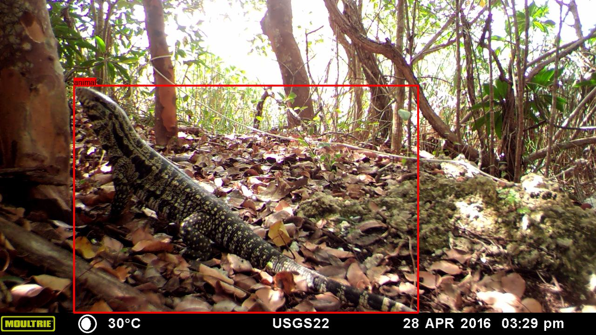

Image credit [UNSW Predators dataset](https://lila.science/datasets/unsw-predators/)

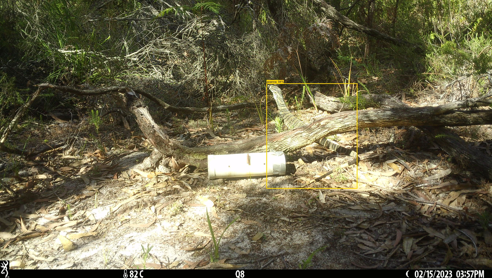

Image credit USGS

## Pre-training

All of the models I'll describe below were pre-trained on non-empty images (specifically, images with non-blank labels and above-threshold detections) from the [MDv5 results for LILA datasets](https://lila.science/megadetector-results-for-camera-trap-datasets/), specifically for LILA camera locations that are not in the MDv1000 validation set.  More specifically, I used the version of each set of results on which I had done [repeat detection elimination](https://github.com/agentmorris/MegaDetector/tree/main/megadetector/postprocessing/repeat_detection_elimination), a semi-manual process for removing lots of false positives (and therefore allowing one to work with results at a lower confidence threshold).  LILA has nearly zero human/vehicle images, so during pre-training, this was combined with human+vehicle images that would become part of the actual training split.  This pre-training was (probably?) useful for three reasons:

* As per above, there are some images used to train MDv5 that I no longer have access to.  Maybe pre-training this way helps MD "remember" stuff from the training data that is no longer accessible.  This is a neat idea in principle, but how much of this survives the real training (which is much longer) is hard to say, so, I'm not banking on this.

* Because of the repeat detection elimination step, training on these boxes isn't pure distillation: the RDE process adds quite a bit of information to the results (by removing false detections).  And I figured that since I've been doing that RDE one dataset at a time for a few years, MegaDetector might as well benefit from it.  And in fact, for the smallest models, the actual training adds just a *bit* of accuracy beyond pre-training.  I.e., pre-training on RDE'd MDv5 boxes is almost enough to saturate a smaller model.  This is not true for the larger models, where this pre-training did not nearly saturate learning.

* But the real reason (and the most boring reason) was that I was trying to save calendar time... I had a bunch of data prep work to do on the actual training data, and if I could keep my GPUs busy during this time to get the model(s) to a better starting point before training, and save a couple days (for small models) or a couple of weeks (for YOLOv5x6), then, so the idea went, I would be able to get this release out faster.  Ironically this release got stalled for a zillion unrelated reasons, so any time I saved this way didn't really make a difference.

Overall, this step didn't hurt, but I am not doing a thorough assessment of how much it helped.

## Introducing MDv1000

<i>Finally</i>, links to models (with MDv4 and MDv5 for comparison)...

| model name | architecture | <i>normalized</i> animal AP.5:.95 | input size | FLOPs (B) | ILMS |
| :--- | :--- | :--- | :--- | :--- | :--- |
| [MDv1000-redwood](https://github.com/agentmorris/MegaDetector/releases/download/v1000.0/md_v1000.0.0-redwood.pt) | YOLOv5x6 | 1.009 | 1280 | 209.8 | GPL |
| [MDv5a](https://github.com/agentmorris/MegaDetector/releases/download/v5.0/md_v5a.0.1.pt) | YOLOv5x6 | 1.000 (by definition)  | 1280| 209.8 | GPL |
| [MDv1000-cedar](https://github.com/agentmorris/MegaDetector/releases/download/v1000.0/md_v1000.0.0-cedar.pt) | YOLOv9c | 0.991 | 640 | 102.1 | GPL |
| [MDv5b](https://github.com/agentmorris/MegaDetector/releases/download/v5.0/md_v5b.0.1.pt) | YOLOv5x6 | 0.986 | 1280 | 209.8 | GPL |
| [MDv1000-larch](https://github.com/agentmorris/MegaDetector/releases/download/v1000.0/md_v1000.0.0-larch.pt) | YOLOv11L | 0.969 | 640 | 86.9 | AGPL |
| [MDv1000-sorrel](https://github.com/agentmorris/MegaDetector/releases/download/v1000.0/md_v1000.0.0-sorrel.pt) | YOLOv11s | 0.967 | 960 | ~30 | AGPL |
| [MDv1000-spruce](https://github.com/agentmorris/MegaDetector/releases/download/v1000.0/md_v1000.0.0-spruce.pt) | YOLOv5s | 0.864 | 640 | 16.5 | GPL |
| [MDv4](https://lilawildlife.blob.core.windows.net/lila-wildlife/models/camera_traps/megadetector/md_v4.1.0/md_v4.1.0.pb) | faster-rcnn | ~0.79 | ~1024 | a <i>lot</i> | Apache |

Definitions for the columns in that table:

* <b>model name</b>: just what it sounds like... it would have been fun to name the models after animals, but, e.g., "MDv1000-elephant" sounds like a detector that only finds elephants, so that wasn't an option.  So, I went with trees.
* <b>architecture</b>: the AI model architecture this model is based on.
* <b>normalized animal AP.5:.95</b>: "AP.5:.95" is common measure of accuracy for object detection models; the values presented in this table are <i>normalized using MDv5a as a reference value</i>.  Specifically, this is the AP.5:.95 value, just for the animal class, as computed by the [review_object_detection_metrics](https://github.com/rafaelpadilla/review_object_detection_metrics) package.  Values for other categories and using other metrics (e.g. AP50, AP75) follow the same trend, so, keeping it simple: higher is better.
* <b>input size</b>: the pixel size at which the model was trained and the size at which it will run by default (on the long side, typically the width).
* <b>FLOPs</b>: the number of floating-point operations (in billions) required to run one image through the model (higher number == slower model).  These values are provided by the developers of each architecture.  Because MDv1000-sorrel is trained at larger size than the default size, it will run slower than what is reported by the developer, so for that model, I'm extrapolating from the reported number for the default size.  The others are all trained at their default size.
* <b>ILMS</b>: an acronym I just made up for "inference license that makes sense".  It's above my pay grade to tell you what the applicable license is if you, e.g., export the weights to another format and use your own code to run it; I'm just capturing the license of the default inference code.

<b>Why not release absolute accuracy numbers?</b>

Absolute AP numbers say at least as much about the validation dataset as they do about a model, so for the same reason I've never published accuracy figures for MDv5, I'm not (at least for now) publishing absolute accuracy figures for MDv1000 on my validation dataset.  In other words, no one should make any assumptions - about how many animals you'll miss at a particular confidence threshold, or how much time a model will save you - on <i>your</i> data based on figures generated on <i>someone else's</i> data.  If you can predict how a model will perform on a new dataset based on validation data from an unrelated dataset, you can have a free PhD in computer science!  I've also been burned trying to replicate accuracy numbers that turned out to either be very dataset-specific or just good-old-fashioned wrong, and I don't want to send someone down the same wild animal chase1.

So, I look forward to seeing the community publish evaluations on diverse datasets, just like we saw for MDv5.

Even these relative numbers make me a little nervous; my subjective experience does not put the smaller models (e.g. MDv1000-larch, MDv1000-sorrel) as close to MDv5a as these numbers would indicate.  But the <i>order</i> of these numbers is consistent with my experience.  In any case, tl;dr: all that matters is how models perform on <i>your</i> data.

1See what I did there?  Because MegaDetector doesn't know about species?  So "wild animal chase" instead of "wild goose chase"?

### Why so many models?

Each of these models fills a specific niche:

* MD1000-redwood (the largest model) is the one I reach for (alongside MDv5) when I'm responsible for sending the most accurate results I can to a user.  For this model, I chose YOLOv5x6 (the same architecture as MDv5) because (a) it is still (around) the highest accuracy on COCO among Ultralytics model families, (b) it was the last Ultralytics model whose recommended inference code carried a GPL (rather than AGPL) license, and (c) using the same architecture as MDv5 allowed me to do a pretty apples-to-apples comparison of the whole training process against MDv5.

* MDv1000-spruce (based on YOLOv5s) was built specifically for the Conservation X Labs [Sentinel](https://sentinel.conservationxlabs.com/) device, a module that adds edge AI capabilities and connectivity to existing camera traps.  I have one in my backyard; here are two wild animals and a domestic animal (it's an exercise for the reader to guess which is which) cropped with MD <i>on the device</i> before being uploaded:

  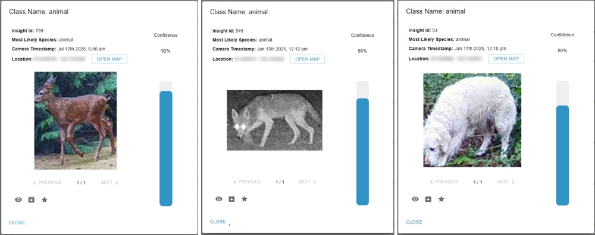

* MDv1000-sorrel (based on YOLOv11s) was built specifically for the [DeepFaune](https://www.deepfaune.cnrs.fr/en/) application, as part of an ensemble (run alongside their own detector) that they will release shortly (as of the time that I'm writing these release notes, in July 2025).  DeepFaune also supports MDv5a.

* MDv1000-cedar (based on YOLOv9c) and MDv1000-larch (based on YOLOv11L) are intended to provide intermediate speed/accuracy tradeoffs.

### Which model should I use?

My general advice is: <i>use the largest model your time budget allows</i>, and only use the smaller models if you're sure you need them.  Faster sounds better, but in a world where a regular laptop with no GPU can process 50k images per day even through MDv5, and GPUs that can run even MDv5/MD1000-redwood on 1M images per day come standard on home PCs now, the scenario where the speed difference between, e.g., MDv1000-redwood and MDv1000-cedar (~2x difference on a CPU) makes a qualitative difference is narrow.  And if in practice running 2x faster means you need to lower your confidence threshold to preserve recall, you've reduced compute time to increase human time, which is almost never a tradeoff you want to make.

In terms of deciding among the largest models, here's how I think about it:

* If you're already using MDv5a or MDv5b, and you're happy with it, keep using it until you have enough time and labeled data to do a thorough comparison on your data against MDv1000-redwood.
* If you're starting from scratch and you want the safe thing that has been studied extensively in the literature, use MDv5a.
* If you want to join me on the cutting edge, or if you have large reptiles and/or you experience the "boxes in the sky" problem with MDv5, use MDv1000-redwood.
* If you absolutely want to maximize recall, and you're not crunched for time (e.g. you're running images overnight anyway), consider running MDv5a <i>and</i> MDv1000-redwood, and combining the results with the [merge_detections](https://megadetector.readthedocs.io/en/latest/postprocessing.html#module-megadetector.postprocessing.merge_detections) module.

### Confidence value considerations when comparing to MDv5 (or other models)

<i>tl;dr: confidence thresholds don't translate verbatim to new models, if you're an MDv5 user, you may have to experiment a little to find a preferred threshold for MD1000, and it will probably be a higher threshold than you used with MDv5.</i>

The default confidence threshold I typically use for MDv5 is 0.2, and this doesn't quite translate to the MDv1000 models; a good default threshold for the new models is probably more like 0.3 or even 0.4.  So for most datasets, comparing precision/recall at the MDv5 default threshold of 0.2 will almost definitely tell you that MD1000-redwood has higher recall (i.e., finds more animals) and lower precision (i.e., finds more rocks and sticks) than MDv5, but not in a meaningful way.

If you have the luxury of a large labeled dataset of your own images, you can do an apples-to-apples comparison: for example, choose a threshold you like for MDv5a (typically between 0.1 and 0.2), then choose the threshold for one of the MDv1000 models (or any other model you want to study) that produces the same recall (i.e., finds the same number of actual animals), and compare the number of false positives across models at those thresholds.  For a given recall level, the one that produces the smaller number of false positives is better.

Often, however, you want to compare models in a scenario where you <i>don't</i> have ground truth, so I have a couple of functions that help me with this kind of comparison:

* [find_equivalent_threshold](https://megadetector.readthedocs.io/en/latest/postprocessing.html#megadetector.postprocessing.compare_batch_results.find_equivalent_threshold): given two sets of detector results and a threshold for model A, find the threshold for model B that produces the same number of total positives, so you can do a "fair" comparison between two models
* [compare_batch_results](https://megadetector.readthedocs.io/en/latest/postprocessing.html#megadetector.postprocessing.compare_batch_results.compare_batch_results): takes two .json results files, randomly samples a subset of images, and makes an HTML file showing where they agree and disagree, given thresholds for both (typically determined with find_equivalent_threshold).  I.e., what images do they both think are animals/empty?  What images do models A/B think have animals that the other model thinks are empty?

So typically what I do when I want to compare two models without ground truth is choose a reasonable threshold for one model (often 0.2 for MDv5a), find the equivalent threshold (producing the same number of positives) for the other model using find_equivalent_threshold(), then run compare_batch_results() to produce an HTML comparison page.  By definition, they'll have the same number of detections at these thresholds.  And in fact, when comparing two reasonable detectors (even MDv4!), at reasonable thresholds, both the "stuff only model A called an animal" and "stuff only model B called an animal" pages will always be mostly junk.  And there will almost always be something that the "worse" model found that the better model missed at equivalent thresholds (e.g. real animals MDv4 found that MDv5 or MDv1000-redwood did not).    But if, for example, "model A" is the model I expect to be better, what I want to see when I'm running comparisons like this is that the "only model A found an animal" page has more real animals than the "detections B only" page.

### Why "MDv1000"?

Because "1000" means "awesome", you know, like the [T-1000](https://en.wikipedia.org/wiki/T-1000), or [Baseball Simulator 1.000](https://en.wikipedia.org/wiki/Baseball_Simulator_1.000) (which the community has agreed is pronounced "Baseball Simulator one thousand", punctuation notwithstanding).

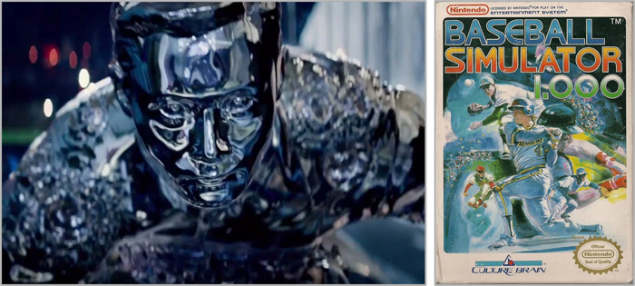

OK those are indeed awesome things, but that's actually not the reason.  Between when I started working on this project and when I released it, Microsoft released an "MDv6" model family, so it would have been <i>bananas</i> confusing for me to also call this release "MDv6".  Calling it "MDv7" would have implied that it was a direct improvement on MDv6, which is not accurate and would have been unfair to MDv6.  So, MDv1000 it is.

## (Formally) introducing the MD Python package

Before I get into Python package stuff, a reminder that most users don't care about this section: MegaDetector is available via lots of tools and platforms that don't require you to run any Python code.  But, if you run MD yourself at the command line, or you're <i>building</i> one of those platforms, this section is for you.

The [MegaDetector Python package](https://pypi.org/project/megadetector/) is a pip-installable Python package for "doing MegaDetector stuff", which of course includes running MegaDetector.  It has been available since 2023, but for a while, we discouraged users from running MDv5 through the Python package.  This wasn't because anything was wrong with the Python package, rather, MDv5 was trained with a version of the YOLO framework that was not pip-installable, so precisely replicating the training environment was fundamentally incompatible with installing a Python package.  So, for a long time, due to maybe an excessive focus on reproducibility, we encouraged users to run MDv5 by cloning the MegaDetector GitHub repo locally.

Reproducibility is great, but it has its limits: we're talking about whether confidence values agree with the "right" values at like the fourth decimal place.  And at some point, the hassle of cloning a bunch of GitHub repos outweighed the benefits of perfectly recreating the training environment, so a few months ago, the standard [instructions](https://github.com/agentmorris/MegaDetector/blob/main/megadetector.md#using-megadetector) switched to using the Python package, but I have never really evangelized or publicly described what it's all about.  So, I'm using this release to - two years after it actually launched - introduce the MD Python package.  Huzzah.

Specifically, I'm going to walk through the things the MD Python package does in three chunks:

* Running MD
* Postprocessing MD output files
* Other utilities in the category "doing the business of camera trap stuff"

All of these are also documented in the [MegaDetector package documentation](https://megadetector.readthedocs.io/).

### Running MD with the MD Python package

Of course, the most important thing the MD Python package does is run MegaDetector on images and videos, primarily through the [run_detector_batch](https://megadetector.readthedocs.io/en/latest/detection.html#module-megadetector.detection.run_detector_batch) module (the command-line interface to this module is documented [here](https://megadetector.readthedocs.io/en/latest/detection.html#run_detector_batch---CLI-interface).  For example, the command line recommended in the MegaDetector "getting started" instructions looks like this:

`python -m megadetector.detection.run_detector_batch.py MDV5A "c:\some_image_folder" "c:\path\to\output.json" --output_relative_filenames --recursive --quiet`

In this example, "MDV5A" tells the module to use MDv5a.  This field is case-insensitive, and supports any of the following strings:

* mdv5a
* mdv5b
* mdv1000-redwood
* mdv1000-cedar
* mdv1000-larch
* mdv1000-sorrel
* mdv1000-spruce

Those are the "official" short names, but the module tries to be forgiving; for example, saying "md1000-redwood" instead of "mdv1000-redwood" is OK.  Any filename can also be used here to load a MD model from a local file.  Instead of specifying a model, you can also use the strings "default" and "megadetector", both of which will tell the module to use whatever model version I recommend as the default (at the time of the package release you're using).  Until the community has had time to experiment with the new models, the default is still MDv5a.

NB: I prefer that the Python package not take AGPL dependencies, so the MD Python package only includes the dependencies to run the non-AGPL models (MDv5, MDv1000-redwood, MDv1000-cedar, MDv1000-spruce).  If you try to run MDv1000-larch or MDv1000-sorrel, you'll get a hopefully-very-straightforward message saying "please run `pip install ultralytics`", and after you do that, everything should work.

Here are some other options to this script you might want to experiment with if you're feeling adventurous and you want to squeeze every bit of accuracy out of MD:

* `--augment`: enable image augmentation, which is roughly saying "think a little harder".  In general this will increase compute time by around 1.6x, and will slightly improve accuracy (but may require higher confidence thresholds).
* `--image_size`: by default the package reads the default image size from the model itself; this option lets you run the model at an image size other than the default.  You would almost never use this option to run at a <i>smaller</i> size than the default, but increasing the image size may improve accuracy a bit, at the cost of some compute time.  Anecdotally, the models trained at 1280px yield higher accuracy when run at sizes up to at least 1600px.

Other useful modules in the [detection subpackage](https://megadetector.readthedocs.io/en/latest/detection.html):

* [process_video](https://megadetector.readthedocs.io/en/latest/detection.html#module-megadetector.detection.process_video) is the video equivalent of run_detector_batch: it runs MD on videos (typically a folder of videos), including options for time- or frame-based sampling, rendering videos with boxes, etc.
* [run_tiled_inference](https://megadetector.readthedocs.io/en/latest/detection.html#module-megadetector.detection.run_tiled_inference) breaks large images up into pieces closer to MD's native input size, runs MD separate on them, and stitches the results back together in a reasonable way.  I use this when I'm working on scenarios where very small animals are <i>just</i> out of MD's domain, but we have pixels to spare (e.g. we have 4k images).

### Postprocessing with the MD Python package

The MD Python package provides lots of tools for working with the .json files in the [MegaDetector output format](https://lila.science/megadetector-output-format) (which may also includes species classification results).  These tools are all part of the [megadetector.postprocessing](https://megadetector.readthedocs.io/en/latest/postprocessing.html) subpackage.  I'm not going to provide a comprehensive guide here, just a flavor for some of the modules available in this subpackage, to hopefully help folks avoid reinventing the wheel!

* [postprocess_batch_results](https://megadetector.readthedocs.io/en/latest/postprocessing.html#module-megadetector.postprocessing.postprocess_batch_results): the most important module in this subpackage; generates an HTML preview from a MD results file (typically sampling something like 10k images), separating images into "non-detections", "animals", etc.  The goal is to make it easy for users to grok how MD did on their data, even when ground truth isn't available.  Sample output:
  * [...when no ground truth is available](https://lila.science/public/snapshot_safari_public/snapshot-safari-kar-2022-00-00-v5a.0.0_0.200/)
  * [...when ground truth is available](https://lila.science/public/snapshot_safari_public/snapshot-safari_KAR_mdv5a.0.0_results.filtered_rde_0.150_0.850_15_0.200_gt)
  * [...with species classification results](https://lila.science/public/speciesnet-previews/speciesnet-postprocessing-examples/caltech-camera-traps/) (in this case from [SpeciesNet](https://github.com/google/cameratrapai)) ([bonus example](https://lila.science/public/speciesnet-previews/speciesnet-postprocessing-examples/idaho-camera-traps/), [other bonus example](https://lila.science/public/speciesnet-previews/speciesnet-postprocessing-examples/orinoquia-camera-traps/))
* [create_crop_folder](https://megadetector.readthedocs.io/en/latest/postprocessing.html#module-megadetector.postprocessing.create_crop_folder): given MD results, creates a folder of cropped images, optionally generating a new .json file that associates them back to the original images.  Handy for running classifiers.
* [classification_postprocessing](https://megadetector.readthedocs.io/en/latest/postprocessing.html#module-megadetector.postprocessing.classification_postprocessing): functions for taxonomy-aware postprocessing species classification results, particularly (a) smoothing results within an image (an image with 700 cows and one deer is really just 701 cows) and (b) smoothing results within a sequence (a sequence that looks like deer/deer/deer/elk/deer/deer is really just a deer).
* [compare_batch_results](https://megadetector.readthedocs.io/en/latest/postprocessing.html#module-megadetector.postprocessing.compare_batch_results): compare multiple sets of MD results, typically used to compare different model versions of different configurations (e.g., the same model with and without augmentation).  Generates HTML pages that make it easy to grok differences when ground truth isn't available, and generates sample FP/FN/TP/FN images when ground truth is available.
* [validate_batch_results](https://megadetector.readthedocs.io/en/latest/postprocessing.html#module-megadetector.postprocessing.validate_batch_results): validity checker for MD-formatted .json files (boring, but important)
* [md_to_coco](https://megadetector.readthedocs.io/en/latest/postprocessing.html#module-megadetector.postprocessing.md_to_coco): convert MD results to COCO format
* [md_to_labelme](https://megadetector.readthedocs.io/en/latest/postprocessing.html#module-megadetector.postprocessing.md_to_labelme): convert MD results to labelme format
* [merge_detections](https://megadetector.readthedocs.io/en/latest/postprocessing.html#module-megadetector.postprocessing.merge_detections): merge detections from multiple .json files, typically used when I want to run multiple MD versions or configurations and get the best of both worlds.
* [separate_detections_into_folder](https://megadetector.readthedocs.io/en/latest/postprocessing.html#module-megadetector.postprocessing.separate_detections_into_folders): given a .json results file, separate the images into folders that contain animals/people/vehicles/nothing, according to per-class thresholds, preserving relative paths within each folder.  Can also be used when species classification results are available.

Bonus module, technically in the [megadetector.visualization](https://megadetector.readthedocs.io/en/latest/visualization.html) subpackage, but in the spirit of working with .json results files:

* [visualize_detector_output](https://megadetector.readthedocs.io/en/latest/visualization.html#module-megadetector.visualization.visualize_detector_output): render boxes onto images, and optionally make an HTML page that makes it easier to review those images.

### Other utilities: the business of doing camera trap stuff

Lastly, there is a bunch of functionality in the MegaDetector package that isn't directly related to MegaDetector, but is about working with large collections of images and are useful to me when I'm doing camera-trap-related work (including work on [LILA](https://lila.science))... a few examples:

* [integrity_check_json_db](https://megadetector.readthedocs.io/en/latest/data_management.databases.html#module-megadetector.data_management.databases.integrity_check_json_db): validate COCO-formatted .json files, especially in the [COCO Camera Traps](https://lila.science/coco-camera-traps) variant on the COCO format that adds some metadata specific to camera traps.
* [coco_to_labelme](https://megadetector.readthedocs.io/en/latest/data_management.html#module-megadetector.data_management.coco_to_labelme), [coco_to_yolo](https://megadetector.readthedocs.io/en/latest/data_management.html#module-megadetector.data_management.coco_to_yolo), [yolo_to_coco](https://megadetector.readthedocs.io/en/latest/data_management.html#module-megadetector.data_management.yolo_to_coco), [labelme_to_coc](https://megadetector.readthedocs.io/en/latest/data_management.html#module-megadetector.data_management.labelme_to_coco), [labelme_to_yolo](https://megadetector.readthedocs.io/en/latest/data_management.html#module-megadetector.data_management.labelme_to_yolo): exactly what they sound like
* [rename_images](https://megadetector.readthedocs.io/en/latest/data_management.html#module-megadetector.data_management.rename_images): flatten folder structure and include EXIF timestamps in filenames, roughly equivalent to the [imageRename](https://www.rdocumentation.org/packages/camtrapR/versions/2.3.0/topics/imageRename) function in the [camtrapR](https://github.com/cran/camtrapR/tree/master) package
* [remove_exif](https://megadetector.readthedocs.io/en/latest/data_management.html#module-megadetector.data_management.remove_exif): remove EXIF information from a folder of images, typically used to remove location information or other sensitive metadata before publishing
* [read_exif](https://megadetector.readthedocs.io/en/latest/data_management.html#module-megadetector.data_management.read_exif): read EXIF information from large image collections, parallelized across threads or processes
* [parallel_copy_files](https://megadetector.readthedocs.io/en/latest/utils.html#megadetector.utils.path_utils.parallel_copy_files): copy files (typically images) according to a dict mapping source to destination paths, parallelized across threads or processes
* [split_locations_into_train_val](https://megadetector.readthedocs.io/en/latest/utils.html#module-megadetector.utils.split_locations_into_train_val): splits a list of location IDs into training and validation sets, targeting a specific train/val split for each category, but allowing some categories to be tighter or looser than others
* [resize_image_folder](https://megadetector.readthedocs.io/en/latest/visualization.html#megadetector.visualization.visualization_utils.resize_image_folder): resize all images in a large collection, parallelized across threads or processes; typically used to resize images to a smaller size prior to training or repeated inference

That's just a "sampler", but it gives you a feel for the kinds of tools in the package that are generally about "the business of doing camera trap business".

## What's next?

Now a bit of prognisticating on what's next in my MegaDetector-verse.

### Short-term: back to the data workshop... and SpeciesNet!

Over the next few weeks, I will probably train one more model using the same training dataset, but I'm not in a rush to train a zillion more models just to add more points on the speed/accuracy curve, unless they fit specific user needs.  I've also already identified some cases where neither MDv5 nor MDv1000 totally crush it, in fact I've seen some cases where they struggle badly, so I will continue to grow the training dataset accordingly and work toward future re-training.  I wouldn't say that putting boxes on images is ever "fun", but with the [labelme variant](https://github.com/agentmorris/labelme) I described earlier, it's somewhere in the neighborhood of "healthy mindless task I can do while I'm tired and I listen to a podcast", so this will continue to be a background thread.

But mostly what I'm excited about right now is making [SpeciesNet](https://github.com/google/cameratrapai) shine in the ecosystem that has already embraced MegaDetector, which will require working out some best practices for working with SpeciesNet, taking on some hard user cases that require customization or fine-tuning, and continually improving the SpeciesNet inference tools.

Gratuitous SpeciesNet image:

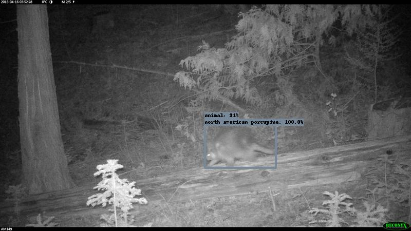

Image credit [Idaho Camera Traps dataset](https://lila.science/datasets/idaho-camera-traps/)

Why <i>wouldn't</i> I want to play with this super-fun new toy?

And I will continue to run inference for users whenever it's helpful... send me your disasters, your insufferably large piles of images, your quirky cases that fall between gaps in the tools, etc.  Really, I love processing images for users, so if you want help, <a href="mailto:agentmorris@gmail.com">email me</a>!

### Long-term: toward a "community MegaDetector"

I'm excited about this release, but it's yet another detector that relies on non-public training data, and the more users and systems that depend on MD, the less I wish that were the case.  Right now there are three datasets that exist in the universe that correspond to publicly-available detectors: MDv1000, MDv6, and [Conservation AI](https://www.conservationai.co.uk/).  All are great datasets, but there are soooooo many images available on [LILA](https://lila.science/category/camera-traps/) (O(low tens of millions)), increasing public accessibility of the images on [Wildlife Insights](https://www.wildlifeinsights.org/) (O(low hundreds of millions)), and the increasing use of [CamtrapDP](https://inbo.github.io/camtrapdp/) to make images available via [GBIF](https://www.gbif.org/) (just getting started, but very promising).  With all of those images out there, it seems like if we rally as a community, we could assemble a detector training dataset that beats all present-day SOTA detectors, so <i>I'm hoping that MDv1000 is the <u>last</u> detector I release using non-public data</i>.

That ignores some complicated realities: there are still <i>some</i> taxonomic gaps in public data, for example, but I think volume largely compensates for those gaps.  Plus, that's part of rallying the community.  There's also the issue of human/vehicle images, which will likely never be publicly available, but if we're creative as a community, this doesn't have to be a dealbreaker either: there are lots of systems focused on detecting humans and vehicles that have nothing to do with wildlife, and we can leverage those, or perhaps we'll always have a combination of a private-data human/vehicle detector and a public-data animal detector.  It helps that by and large, humans and vehicles are much easier to see than animals, so it's likely that we can combine a relatively small human/vehicle detector with a much larger animal detector.  Let's be creative as a community!

### What do LLMs mean for the future of camera trap AI?

So, here I am, releasing an object detector in 2025 that isn't conceptually <i>that</i> different than the object detectors we had in 2018.  No semantic understanding, no benefiting from all the Wikipedia pages telling us what animals look like, etc.  But it turns out a few things have happened since 2018 that point to new ways of thinking about this problem.

That said, even frontier VLMs are still not great at difficult fine-grained localization tasks (including object detection in the difficult scenes we're used to in the camera trap world), although I am 100.000000% sure that frontier VLMs will get awesome at this task soon (maybe between when I write this markdown file and when you read it), because there seems to be no end to what VLMs can do.  And although wildlife detection isn't the next trillion-dollar business, object detection in difficult scenes <i>is</i> real business, so just like our community has been advanced by ten years of steady improvements to detection and classification tools built for other domains, we'll also reap the benefits as VLMs get better at localization tasks.

I still don't see a world where someone uploads every image to a frontier model: that's a bad fit for camera trap workloads in terms of cost, carbon, latency, and privacy.  But at the very least, LLMs are going to at least fundamentally change the way we create training data, or even what training data means.  Can you envision a world where you hand an LLM a pile images where MegaDetector (or any model) dropped the ball, and say "hey, LLM, please fine-tune the model to fix these cases?".  Or building a training dataset by saying "LLM, please put bounding boxes on all of these images, and just check in with me for the hard ones?".  Or teaching an LLM to recognize animals in sequences of images the same way you would teach a new intern, then use that context to generate a zillion training boxes?  I can definitely imagine that world.

These are great topics of discussion for the [CamTrapAI](https://camtrapai.github.io/) workshop, which happens to be in Seattle (more or less where I live) in September, so if pontificating about the future of camera trap AI gets you fired up, come to Seattle, make new camera trap friends, and come for an early-morning wildlife walk with me and my dog! (Yes, the same dog who appears earlier on this page).

## Acknowledgments

Thanks to everyone who made this release possible, including:

* Data contributors, including everyone who has provided [data for LILA](https://lila.science/category/camera-traps/), everyone who provided data to me directly, and especially the folks who sent me 750k+ images of people and vehicles, which I really needed... you know who you are. :)
* [Siyu](https://www.linkedin.com/in/yangsiyu007/) and [Sara](https://beerys.github.io/), without whom there would be no MegaDetector at all.
* [Direct contributors to the MegaDetector repo](https://github.com/agentmorris/MegaDetector/graphs/contributors), e.g. [Doantam](https://www.linkedin.com/in/doantam-phan/), who made significant improvements to the [RDE](https://github.com/agentmorris/MegaDetector/tree/main/megadetector/postprocessing/repeat_detection_elimination) tools, and [Alex](https://www.linkedin.com/in/alex-morling/), who got me started with a legit documentation system.
* All the contributors to the [ecosystem of camera trap AI platforms](#ecosystem-explosion) I described earlier.  Models are fine, but ecologists don't care about weights files; the community of tools that put models to work for conservation are where we actually benefit our users.
