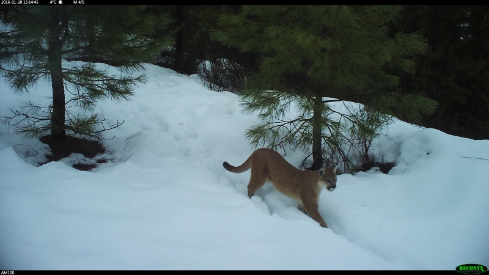

# Overview

This directory contains utilities for visualizing ground truth annotations and MegaDetector/classifier predictions.

# Folder contents

* [plot_utils.py](plot_utils.py) contains graphing utilities that are used by [postprocess_batch_results.py](https://github.com/agentmorris/MegaDetector/blob/main/api/batch_processing/postprocessing/postprocess_batch_results.py)
* [visualization_utils.py](visualization_utils.py) contains shared utility functions for drawing boxes and labels on images in a zillion different ways
* [visualize_db.py](visualize_db.py) samples images from a .json file in [COCO Camera Traps](https://github.com/agentmorris/MegaDetector/tree/main/data_management#coco-camera-traps-format) format, and renders the corresponding annotations to an HTML preview page.  Typically used when you've just assembled a COCO Camera Traps .json file and you want to make sure everything is sensible.
* [visualize_detector_output.py](visualize_detector_output.py) renders images with bounding boxes to a folder, based on a MegaDetector output .json file.

# Gratuitous camera trap picture

 Image credit Idaho Department of Fish and Game, from the [Idaho Camera Traps](https://lila.science/datasets/idaho-camera-traps/) data set.
