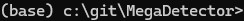
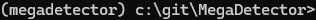
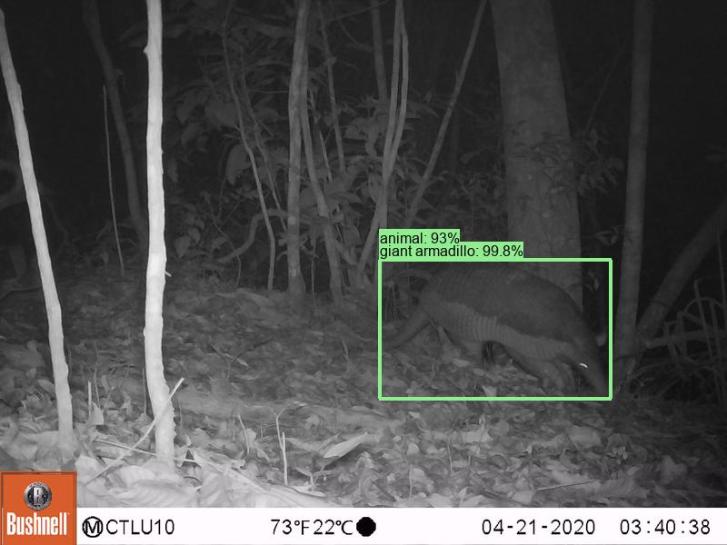

# MegaDetector User Guide

## Table of contents

1. [MegaDetector overview](#megadetector-overview)
2. [Our ask to MegaDetector users](#our-ask-to-megadetector-users)
3. [Using MegaDetector](#using-megadetector)  
4. [Using a GPU](#using-a-gpu)  
5. [How do I use the results?](#how-do-i-use-the-results)
6. [Downloading MegaDetector (optional)](#downloading-megadetector-optional)
7. [MegaDetector versions](#megadetector-versions)
8. [How fast is MegaDetector, and can I run it on my giant/small computer?](#how-fast-is-megadetector-and-can-i-run-it-on-my-giantsmall-computer)
9. [Is there a GUI?](#is-there-a-gui)
10. [Who is using MegaDetector?](#who-is-using-megadetector)
11. [What about species classification?](#what-about-species-classification)
12. [Pro tips for large workloads](#pro-tips-for-large-workloads)
15. [Pro tips for coaxing every bit of accuracy out of MegaDetector](#pro-tips-for-coaxing-every-bit-of-accuracy-out-of-megadetector)
13. [Have you evaluated MegaDetector's accuracy?](#have-you-evaluated-megadetectors-accuracy)
14. [What is MegaDetector bad at?](#what-is-megadetector-bad-at)
16. [Citing MegaDetector](#citing-megadetector)
17. [Pretty picture and mesmerizing video](#pretty-picture-and-mesmerizing-video)
18. [Can you share the training data?](#can-you-share-the-training-data)


## MegaDetector overview

Conservation biologists invest a huge amount of time reviewing camera trap images, and much of that time is spent reviewing images they aren't interested in.  This primarily includes empty images, but for many projects, images of people and vehicles are also "noise", or at least need to be handled separately from animals.

*AI can accelerate this process, letting biologists spend more time on science, and less time clicking through images.*

To this end, this page hosts a model we've trained - called "MegaDetector" - to detect animals, people, and vehicles in camera trap images.  It does not identify animals to the species level, it just finds them.  

Before you read the rest of this page...

* If you are looking for a convenient GUI-based tool to run MegaDetector, you don't need anything from this page: check out [AddaxAI](https://addaxdatascience.com/addaxai/) (formerly EcoAssist).  AddaxAI is how 95% of users run MegaDetector.
* If you're just <i>considering</i> the use of AI in your workflow, and you aren't even sure yet whether MegaDetector would be useful to you, we recommend reading the much shorter "[getting started with MegaDetector](getting-started.md)" page.
* If you're a programmer-type looking to use tools from this repo, check out the [Python package](https://pypi.org/project/megadetector/) that provides access to everything in this repo (yes, you guessed it, "pip install megadetector").
* If you're already familiar with MegaDetector and you're ready to run it on your data, and you're looking for instructions on running MegaDetector, read on!
* If you have any questions, or you want to tell us that MegaDetector was amazing/terrible on your images, <a href="mailto:cameratraps@lila.science">email us</a>!
* If you have zillions of images and you'd like someone to help you dig out of your backlog by processing images for you, <a href="mailto:cameratraps@lila.science">email us</a>!  Processing images is like our favorite thing to do, and it's how we improve our tools.  And it's fast.  And free.  So, never feel bad about asking us to help you out of your backlog.

MegaDetector is just one of many tools that aims to make conservation biologists more efficient with AI.  If you want to learn about other ways to use AI to accelerate camera trap workflows, check out our survey of the field, affectionately titled &ldquo;[Everything I know about machine learning and camera traps](https://agentmorris.github.io/camera-trap-ml-survey/)&rdquo;.


## Our ask to MegaDetector users

MegaDetector is free, and it makes us super-happy when people use it, so we put it out there as a downloadable model that is easy to use in a variety of conservation scenarios.  That means we don't know who's using it unless you contact us (or we happen to run into you), so please please pretty-please email us at [cameratraps@lila.science](mailto:cameratraps@lila.science) if you find it useful!


## Using MegaDetector

### If you already know about Python stuff...

This page is largely intended for users who have not previously run lots of Python code.  If you already know how Python environments work, you may want to skip the rest of this page and use the [MegaDetector Python package](https://pypi.org/project/megadetector/) (pip install megadetector).  There are examples on the package home page, and the package is documented [here](https://megadetector.readthedocs.io/).

If you are new to Python, you are in the right place, read on.

### Overview

We provide two ways to run MegaDetector at the command line:

1. A simple test script that makes neat pictures with boxes around animals, but doesn't produce a useful output file ([run_detector.py](https://github.com/agentmorris/MegaDetector/blob/main/megadetector/detection/run_detector.py)).  We use this in these instructions just to confirm that your environment is set up correctly, then you'll probably never use it again.

2. A script for running large batches of images [run_detector_batch.py](https://github.com/agentmorris/MegaDetector/blob/main/megadetector/detection/run_detector_batch.py)).  This is how you'll run 1000, or 1M, or 10M images through MegaDetector.

Also see the <a href="#is-there-a-gui">&ldquo;Is there a GUI?&rdquo;</a> section for graphical options and other ways of running MD, including real-time APIs, Docker environments, and other goodies.

The remainder of this section will get you set up to run MegaDetector on your computer.

### Install Miniforge

If you are installing Python for the first time, we recommend installing [Miniforge](https://github.com/conda-forge/miniforge).  Miniforge is an environment for installing and running Python stuff.  There are other ways to install Python, and nothing about MegaDetector depends specifically on Miniforge, but it's straightforward to install, so that's what we'll use in these instructions.  If you already have Miniforge, Anaconda, or any other Python environment set up, you can skip this step.

#### Installing Miniforge on Windows

To install Miniforge on Windows, just download and run the [Miniforge installer](https://github.com/conda-forge/miniforge/releases/latest/download/Miniforge3-Windows-x86_64.exe).  If you get a "Windows protected your PC" warning, you might have to click "More info" and "run anyway". You can leave everything at the default value during installation.

All the instructions we provide later in this section will assume you are running at the Miniforge command prompt, which is basically just like a regular command prompt, but it has access to all the Python stuff.  On Windows, once you've installed Miniforge, you can start your Miniforge command prompt by launching the shortcut called "Miniforge prompt".

You will know you are at a Miniforge prompt (as opposed to run-of-the-mill command prompt) if you see an environment name in parentheses before your current directory, like this:



#### Installing Miniforge on Linux/Mac

The [list of Miniforge installers](https://github.com/conda-forge/miniforge?tab=readme-ov-file#miniforge3) has links for Linux and OSX.  If you're installing on a Mac, be sure to download the right installer: "x86_64" if you are on an Intel Mac, "arm64 (Apple Silicon)" if you are on an M1/M2 Mac with Apple silicon.  In all of these cases, you will be downloading a .sh file; after you run it to install Miniforge, you should see an environment name in parentheses just like in the images above.

### Install the MegaDetector Python package

Once you're at your Miniforge prompt, we recommend creating a Python "virtual environment" where you will install MegaDetector stuff.  A virtual environment is a set of Python tools that exist in their own private universe, so they don't bother other Python tools that you have installed in other universes on your computer.  To create an environment called "megadetector", open your Miniforge prompt and run this:

`mamba create -n megadetector python=3.11 pip -y`

Whenever you want to use that environment, open your Miniforge prompt, and run:

`mamba activate megadetector`

After that, you should see a prompt that looks like this:



To install the MegaDetector Python package in this environment, run:

`pip install --upgrade megadetector`

Your environment is set up now!  In the future, when you open your Miniforge prompt, you only need to run `mamba activate megadetector` to use tools from the MegaDetector Python package.

### Hooray, we get to run MegaDetector!

#### run_detector.py (the quick test script)

To test MegaDetector out on one or two images and get super-satisfying visual output, we provide [run_detector.py](https://github.com/agentmorris/MegaDetector/blob/main/megadetector/detection/run_detector.py).  This isn't how we recommend running lots of images through MegaDetector (see [run_detector_batch.py](#run_detector_batchpy) below for "real" usage), but it's a quick way to test things out.

You can launch run_detector.py like this:

```bash
mamba activate megadetector
python -m megadetector.detection.run_detector MDV5A --image_file "some_image_file.jpg" --threshold 0.1
```

"MDV5A" tells this script to automatically download MegaDetector v5a; if you already downloaded it (see the instructions below for [downloading megadetector](#downloading-megadetector-optional)), you can replace this with the full path to your MegaDetector model file (e.g. "c:\megadetector\md_v5a.0.0.pt").  You can replace this with other model names, like "MDV5B" or "MD1000-redwood", or you can say just "default", in which case you'll get the model that the developers consider to be the most accurate model available.  Available models are described in the "[megadetector versions](#megadetector-versions)" section below.

Change "some_image_file.jpg" to point to a real image on your computer, e.g. "c:\my_images\camera_traps\image001.jpg".

If you ran this script on "some_image_file.jpg", it will produce a file called "some_image_file_detections.jpg", which - if everything worked right - has boxes on objects of interest.

You can see all the options for this script by running it with no inputs:

`python -m megadetector.detection.run_detector`

<b>This is really just a test script, you will mostly only use this to make sure your environment is set up correctly</b>.  run_detector_batch.py (see <a href="#run_detector_batchpy">below</a>) is where the interesting stuff happens.

If you have an Nvidia GPU, and it's being utilized correctly, near the beginning of the output from this script, you should see:

`GPU available: True`

If you have an Nvidia GPU and you see "GPU available: False", your GPU environment may not be set up correctly; see the section below called "[using a gpu](#using-a-gpu)".  But as a preview of what you'll find in that section, 99% of the time, if you have an Nvidia GPU and you see "GPU available: False", it's because one of the libraries that MegaDetector depends on likes to install a CPU-only version of itself on Windows.  So if you see that, try this:

```bash
mamba activate megadetector
pip install torch torchvision --upgrade --force-reinstall --index-url https://download.pytorch.org/whl/cu118
```

If that doesn't help, see the section below called "[using a gpu](#using-a-gpu)".


#### run_detector_batch.py

To apply this model to larger image sets, we recommend using [run_detector_batch.py](https://github.com/agentmorris/MegaDetector/blob/main/megadetector/detection/run_detector_batch.py).  This outputs data in the [MegaDetector results format](https://github.com/agentmorris/MegaDetector/tree/main/megadetector/api/batch_processing#megadetector-batch-output-format), so you can work with the results in tools like [Timelapse](https://saul.cpsc.ucalgary.ca/timelapse/).

You can launch run_detector_batch.py like this:

```bash
mamba activate megadetector
python -m megadetector.detection.run_detector_batch MDV5A "c:\some_image_folder" "c:\megadetector\test_output.json" --output_relative_filenames --recursive --checkpoint_frequency 10000 --quiet
```

"MDV5A" tells this script to automatically download MegaDetector v5a; if you already downloaded it (see the instructions below for [downloading megadetector](#downloading-megadetector-optional)), you can replace this with the full path to your MegaDetector model file (e.g. "c:\megadetector\md_v5a.0.0.pt").  You can replace this with other model names, like "MDV5B" or "MD1000-redwood".

Change "c:\some_image_folder" to point to the real folder on your computer where your images live.

This will produce a file called "c:\megadetector\test_output.json", which - if everything worked right - contains information about where objects of interest are in your images.  You can use that file with any of our [postprocessing](megadetector/postprocessing) scripts, but most users will read this file into [Timelapse](https://saul.cpsc.ucalgary.ca/timelapse/).

You can see all the options for this script by running it with no inputs:

`python -m megadetector.detection.run_detector_batch`

#### Re-starting run_detector_batch.py if there's a reboot, crash, etc.

If you are running very large batches, we strongly recommend using the `--checkpoint_frequency` option to save checkpoints every N images (you don't want to lose all the work your PC has done if your computer crashes!).  10000 is a good value for checkpoint frequency; that will save the results every 10000 images.  This is what we've used in the example above.  If your computer crashes/reboots/etc. while the script is running, you can pick up where you left off by running exactly the same command you ran the first time, but adding the "--resume_from_checkpoint auto" option, like this:

`python -m megadetector.detection.run_detector_batch.py MDV5A "c:\some_image_folder" "c:\megadetector\test_output.json" --output_relative_filenames --recursive --checkpoint_frequency 10000 --quiet --resume_from_checkpoint auto`

You will see something like this at the beginning of the output:

`Restored 80000 entries from the checkpoint`


## Using a GPU

If you have an Nvidia GPU on your computer, most AI models (including MegaDetector) can use your GPU to run much faster than they can on your CPU.  Sometimes it takes an extra step to make sure AI models can actually see your GPU, but you only have to do this once.  You can quickly check whether MegaDetector will see your GPU by running:

```
mamba activate megadetector
python -m megadetector.utils.gpu_test
```

If you see "CUDA available (according to PyTorch): True", you're all set.

If you see "No GPUs reported by PyTorch", you may need to take an extra step.  If you've followed the above instructions on Linux, Mac, or [WSL](https://learn.microsoft.com/en-us/windows/wsl/), 99% of the time, MegaDetector will find and use your GPU.  On Windows, there is usually one more step you need to run, specifically installing the GPU version of PyTorch, a library used by MegaDetector.  You can do that by running:

```bash
mamba activate megadetector
pip install torch torchvision --upgrade --force-reinstall --index-url https://download.pytorch.org/whl/cu118
```

Then try running the test script again:

```
mamba activate megadetector
python -m megadetector.utils.gpu_test
```

If it <i>still</i> says "No GPUs reported by PyTorch", 95% of the time, this is fixed by <a href="https://www.nvidia.com/en-us/geforce/drivers/">updating your Nvidia driver</a> and rebooting.  If you have an Nvidia GPU, and you've installed the latest driver, and you've rebooted, and you did everything we suggested here, and you're still seeing "No GPUs reported by PyTorch", <a href="mailto:cameratraps@lila.science">email us</a>.


## How do I use the results?

See the ["How do people use MegaDetector results?"](https://github.com/agentmorris/MegaDetector/blob/main/getting-started.md#how-people-use-megadetector-results) section of our "getting started" page.


## Downloading MegaDetector (optional)

When you run MegaDetector using the instructions earlier on this page, the model file will get downloaded automatically.  If you will not have an Internet connection at the time you run MegaDetector, you might want to download the model file(s) ahead of time.  We include quick links to the models in this section; more information about each version of MegaDetector is available in the [MegaDetector versions](#megadetector-versions) section below.

If you download a model from one of these links, in the above instructions, just replace "MDV5A" with the full path to wherever you downloaded the model file, e.g. "c:\models\md_v5a.0.0pt".

* [MDv5a](https://github.com/agentmorris/MegaDetector/releases/download/v5.0/md_v5a.0.0.pt)
* [MDv5b](https://github.com/agentmorris/MegaDetector/releases/download/v5.0/md_v5b.0.0.pt)
* [MDv4](https://lilawildlife.blob.core.windows.net/lila-wildlife/models/camera_traps/megadetector/md_v4.1.0/md_v4.1.0.pb)


## MegaDetector versions

In this section, we provide information about lots of MegaDetector versions.  Unless you have a very esoteric scenario, you want MegaDetector v5, and you can ignore all the other MegaDetector versions.  The rest of this section, after the MDv5 download links, is more like a mini-MegaDetector-museum than part of the User Guide.

In any script or function that takes a model name, you can always say "default" or "megadetector", in which case you'll always get the model that the MegaDetector developers consider to be the most accurate model available.  But you can also specify the "short name" for any of the models listed below.

### MegaDetector v5.0, 2022.06.15

#### Short names

* MDv5a
* MDv5a

#### Release notes

This release incorporates additional training data, specifically aiming to improve our coverage of:

* Boats and trains in the "vehicle" class
* Artificial objects (e.g. bait stations, traps, lures) that frequently overlap with animals
* Rodents, particularly at close range
* Reptiles and small birds

This release also represents a change in MegaDetector's architecture, from Faster-RCNN to [YOLOv5](https://github.com/ultralytics/yolov5).  Our inference scripts have been updated to support both architectures, so the transition should be <i>mostly</i> seamless.

MDv5 is actually two models (MDv5a and MDv5b), differing only in their training data (see the [training data](#can-you-share-the-training-data) section for details).  Both appear to be more accurate than MDv4, and both are 3x-4x faster than MDv4, but each MDv5 model can outperform the other slightly, depending on your data.  When in doubt, for now, try them both.  If you really twist our arms to recommend one... we recommend MDv5a.  But try them both and tell us which works better for you!  The [pro tips](#pro-tips-for-coaxing-every-bit-of-accuracy-out-of-megadetector) section contains some additional thoughts on when to try multiple versions of MD.

See the [release page](https://github.com/agentmorris/MegaDetector/releases/tag/v5.0) for more details, and in particular, be aware that the range of confidence values produced by MDv5 is very different from the range of confidence values produced by MDv4!  <i>Don't use your MDv4 confidence thresholds with MDv5!</i>

#### Download links

* [MegaDetector v5a (.pt)](https://github.com/agentmorris/MegaDetector/releases/download/v5.0/md_v5a.0.0.pt)
* [MegaDetector v5b (.pt)](https://github.com/agentmorris/MegaDetector/releases/download/v5.0/md_v5b.0.0.pt)

### MegaDetector v4.1, 2020.04.27

#### Short name

MDv4

#### Release notes

This release incorporates additional training data from Borneo, Australia and the [WCS Camera Traps](http://lila.science/datasets/wcscameratraps) dataset, as well as images of humans in both daytime and nighttime. We also have a preliminary "vehicle" class for cars, trucks, and bicycles.

#### Download links

* [Frozen model (.pb)](https://lilawildlife.blob.core.windows.net/lila-wildlife/models/camera_traps/megadetector/md_v4.1.0/md_v4.1.0.pb)
* [TFODAPI config file](https://lilawildlife.blob.core.windows.net/lila-wildlife/models/camera_traps/megadetector/md_v4.1.0/md_v4.1.0.config)
* [Last checkpoint (for resuming training)](https://lilawildlife.blob.core.windows.net/lila-wildlife/models/camera_traps/megadetector/md_v4.1.0/md_v4.1.0_checkpoint.zip)
* [TensorFlow SavedModel for TFServing](https://lilawildlife.blob.core.windows.net/lila-wildlife/models/camera_traps/megadetector/md_v4.1.0/md_v4.1.0_saved_model.zip) (inputs in uint8 format, `serving_default` output signature)

If you're not sure which format to use, you want the "frozen model" file (the first link).

### MegaDetector v3, 2019.05.30

#### Short name

MDv3

#### Release notes

In addition to incorporating additional data, this release adds a preliminary "human" class.  Our animal training data is still far more comprehensive than our humans-in-camera-traps data, so if you're interested in using our detector but find that it works better on animals than people, stay tuned.

#### Download links

- [Frozen model (.pb)](https://lilawildlife.blob.core.windows.net/lila-wildlife/models/camera_traps/megadetector/megadetector_v3.pb)
- [TFODAPI config file](https://lilawildlife.blob.core.windows.net/lila-wildlife/models/camera_traps/megadetector/megadetector_v3.config)
- [Last checkpoint (for resuming training)](https://lilawildlife.blob.core.windows.net/lila-wildlife/models/camera_traps/megadetector/megadetector_v3_checkpoint.zip)
- [TensorFlow SavedModel](https://lilawildlife.blob.core.windows.net/lila-wildlife/models/camera_traps/megadetector/saved_model_normalized_megadetector_v3_tf19.tar.gz) (inputs in TF [common image format](https://www.tensorflow.org/hub/common_signatures/images#image_input), `default` output signature)
- [TensorFlow SavedModel for TFServing](https://lilawildlife.blob.core.windows.net/lila-wildlife/models/camera_traps/megadetector/saved_model_megadetector_v3_tf19.zip) (inputs in uint8 format, `serving_default` output signature)

### MegaDetector v2, 2018

#### Short name

MDv2

#### Release notes

First MegaDetector release!  Yes, that's right, v2 was the first release.  If there was a v1, we don't remember it.

#### Download links

- [Frozen model (.pb)](https://lilawildlife.blob.core.windows.net/lila-wildlife/models/camera_traps/megadetector/megadetector_v2.pb)
- [TFODAPI config file](https://lilawildlife.blob.core.windows.net/lila-wildlife/models/camera_traps/megadetector/megadetector_v2.config)
- [Last checkpoint (for resuming training)](https://lilawildlife.blob.core.windows.net/lila-wildlife/models/camera_traps/megadetector/megadetector_v2_checkpoint.zip)


## How fast is MegaDetector, and can I run it on my giant/small computer?

You can run anything on anything if you have enough time, and for all but the highest-volume users, a laptop CPU is probably enough to run MegaDetector on all your images, and even a basic Nvidia GPU is <i>almost definitely</i> enough to run MegaDetector on all your images.  Here are some rules of thumb to help you estimate how fast you can run MegaDetector on different types of hardware.

* On a decent laptop (without a fancy deep learning GPU) that is neither the fastest nor slowest laptop you can buy in 2025, MegaDetector v5 can process somewhere between 30,000 and 50,000 images per day.  This might be totally fine for scenarios where you have even hundreds of thousands of images, as long as you can wait a few days.
* On a dedicated deep learning GPU that is neither the fastest nor slowest GPU you can buy in 2025, MegaDetector v5 can process between 300,000 and 1,000,000 images per day.  We include a few <a href="#benchmark-timings">benchmark timings</a> below on some specific GPUs.

Often we interact with users who could easily keep up with their image load on their own computer, but they have a huge backlog that's tough to dig out of.  If that's you, <a href="mailto:cameratraps@lila.science">email us</a>!  Processing images is like our favorite thing to do, and it's how we improve our tools.  And it's fast.  And free.  So, never feel bad about asking us to help you out of your backlog.

We don't typically recommend running MegaDetector on embedded devices, although <a href="https://www.electromaker.io/project/view/whats-destroying-my-yard-pest-detection-with-raspberry-pi">some folks have done it</a>!  More commonly, for embedded scenarios, it probably makes sense to use MegaDetector to generate bounding boxes on lots of images from your specific ecosystem, then use those boxes to train a smaller model that fits your embedded device's compute budget.

### Benchmark timings

These results are based on a test batch of around 13,000 images from the public <a href="https://lila.science/datasets/snapshot-karoo">Snapshot Karoo</a> and <a href="http://lila.science/datasets/idaho-camera-traps/">Idaho Camera Traps</a> datasets.  These were chosen to be "typical", and anecdotally they are, though FWIW we have seen very high-resolution images that run around 30% slower than these, and very low-resolution images (typically video frames) that run around 100% faster than these.</i>

Some of these results were measured by "team MegaDetector", and some are user-reported; YMMV.  
  
#### Timing results for MDv5

* An <a href="https://www.nvidia.com/en-us/geforce/graphics-cards/40-series/rtx-4090/">RTX 4090</a> processes around 17.6 images per second, or around 1,500,000 images per day (for MDv5)
* An <a href="https://www.nvidia.com/en-us/geforce/graphics-cards/30-series/rtx-3090-3090ti/">RTX 3090</a> processes around 11.4 images per second, or around 985,000 images per day (for MDv5)
* An <a href="https://www.nvidia.com/en-us/geforce/graphics-cards/30-series/rtx-3080-3080ti/">RTX 3080</a> processes around 9.5 images per second, or around 820,800 images per day (for MDv5)
* A desktop <a href="https://www.nvidia.com/en-us/geforce/graphics-cards/30-series/rtx-3050/">RTX 3050</a> processes around 4.2 images per second, or around 363,000 images per day (for MDv5)
* A laptop  <a href="https://www.nvidia.com/en-us/geforce/graphics-cards/30-series/rtx-3050/">RTX 3050</a> processes around 3.0 images per second, or around 250,000 images per day (for MDv5)
* A <a href="https://www.nvidia.com/content/dam/en-zz/Solutions/design-visualization/productspage/quadro/quadro-desktop/quadro-pascal-p2000-data-sheet-us-nvidia-704443-r2-web.pdf">Quadro P2000</a> processes around 2.1 images per second, or around 180,000 images per day (for MDv5)
* A 2024 M3 MacBook Pro (18 GPU cores) averages around 4.61 images per second, or around 398,000 images per day (for MDv5)
* A 2020 M1 MacBook Pro (8 GPU cores) averages around 1.85 images per second, or around 160,000 images per day (for MDv5)
* An Intel Core i7-12700 CPU processes around 0.5 images per second on a single core (43,000 images per day) (multi-core performance is... complicated) (for MDv5)
* An Intel Core i7-13700K CPU processes around 0.8 images per second on a single core (69,000 images per day) (multi-core performance is... complicated) (for MDv5)

#### Timing results for MDv4

FWIW, MDv5 is consistently 3x-4x faster than MDv4, so if you see a device listed here and want to estimate MDv5 performance, assume 3x-4x speedup.

* An <a href="https://www.nvidia.com/en-us/data-center/v100/">NVIDIA V100</a> processes around 2.79 images per second, or around 240,000 images per day (for MDv4)
* An <a href="https://www.nvidia.com/en-us/geforce/graphics-cards/30-series/rtx-3090/">NVIDIA RTX 3090</a> processes ~3.24 images per second, or ~280,000 images per day (for MDv4)
* An <a href="https://www.nvidia.com/en-us/geforce/graphics-cards/rtx-2080-ti/">NVIDIA RTX 2080 Ti</a> processes ~2.48 images per second, or ~214,000 images per day (for MDv4)
* An <a href="https://www.nvidia.com/en-us/geforce/20-series/">NVIDIA RTX 2080</a> processes ~2.0 images per second, or ~171,000 images per day (for MDv4)
* An <a href="https://www.nvidia.com/en-us/geforce/graphics-cards/rtx-2060-super/">NVIDIA RTX 2060 SUPER</a> processes ~1.64 images per second, or ~141,000 images per day (for MDv4)
* An <a href="https://www.nvidia.com/en-us/titan/titan-v/">NVIDIA Titan V</a> processes ~1.9 images per second, or ~167,000 images per day (for MDv4)
* An <a href="https://www.notebookcheck.net/NVIDIA-Quadro-T2000-Laptop-Graphics-Card.423971.0.html">NVIDIA Titan Quadro T2000</a> processes ~0.64 images per second, or ~55,200 images per day (for MDv4)

#### Contributing to this benchmark list
 
If you want to run this benchmark on your own, here are <a href="https://github.com/agentmorris/MegaDetector/blob/main/sandbox/download_megadetector_timing_benchmark_set.bat">azcopy commands</a> to download those 13,226 images, and we're happy to help you get MegaDetector running on your setup.  Or if you're using MegaDetector on other images with other GPUs, we'd love to include that data here as well.  <a href="mailto:cameratraps@lila.science">Email us</a>!

### User-reported timings on other data

Speed can vary widely based on image size, hard drive speed, etc., and in these numbers we're just taking what users report without asking what the deal was with the data, so... YMMV.

* A GTX 1080 processed 699,530 images in just over 44 hours through MDv5 (4.37 images per second, or ~378,000 images per day)
* An RTX 3050 processes ~4.6 images per second, or ~397,000 images per day through MDv5
* An RTX 3090 processes ~11 images per second, or ~950,000 images per day through MDv5


## Is there a GUI?

Many of our users either use our Python tools to run MegaDetector or have us run MegaDetector for them (see [this page](getting-started.md) for more information about that), then most of those users use [Timelapse](https://saul.cpsc.ucalgary.ca/timelapse/) to use their MegaDetector results in an image review workflow.

But we recognize that Python tools can be a bit daunting, so we're excited that a variety of tools allow you to run MegaDetector in a GUI have emerged from the community.  We're interested in users' perspectives on all of these tools, so if you find them useful - or if you know of others - [let us know](mailto:cameratraps@lila.science), and thank those developers!

### GUI tools for running MegaDetector locally

* [AddaxAI](https://addaxdatascience.com/addaxai/) is a GUI-based tool for running MegaDetector and a variety of species classifiers; also supports a number of postprocessing functions (e.g. folder separation).  This is how most users run MegaDetector.  AddaxAI worried about all the Python stuff in this repo, so that you don't have to.
* [CamTrap Detector](https://github.com/bencevans/camtrap-detector) is a GUI-based tool for running MegaDetector (supports MDv5)
* [MegaDetector-GUI](https://github.com/petargyurov/megadetector-gui) is a GUI-based tool for running MegaDetector in Windows environments (MDv4 only as far as we know)

 
### Interactive demos/APIs

* [Hendry Lydecker](https://github.com/hlydecker) set up a [Hugging Face app](https://huggingface.co/spaces/hlydecker/MegaDetector_v5) for running MDv5
* [Ben Evans](https://bencevans.io/) set up a [Web-based MegaDetector demo](https://replicate.com/bencevans/megadetector) at [replicate.com](https://replicate.com)


### Thick-client tools that leverage MegaDetector

* [DeepFaune](https://www.deepfaune.cnrs.fr/en/)


### Cloud-based platforms that leverage MegaDetector

It's not quite as simple as "these platforms all run MegaDetector on your images", but to varying degrees, all of the following online platforms use MegaDetector:

* [Wildlife Insights](https://wildlifeinsights.org/)
* [TrapTagger](https://wildeyeconservation.org/trap-tagger-about/)
* [WildTrax](https://www.wildtrax.ca/)
* [Agouti](https://agouti.eu/)
* [Trapper](https://trapper-project.readthedocs.io/en/latest/overview.html)
* [Camelot](https://camelotproject.org/)
* [WildePod](https://wildepod.org/)
* [wpsWatch](https://wildlabs.net/inventory/products/wpswatch)
* [TNC Animl](https://animl.camera/) ([code](https://github.com/tnc-ca-geo/animl-frontend))
* [Wildlife Observer Network](https://roadecology.ucdavis.edu/research/projects/wildlife-observer-network)
* [Zooniverse ML Subject Assistant](https://subject-assistant.zooniverse.org/#/intro)
* [Dudek AI Image Toolkit](https://ait.dudek.com)
* [Zamba Cloud](https://github.com/drivendataorg/zamba)
* [OCAPI](https://www.terroiko.fr/ocapi/)


### Other ways of running MegaDetector that don't fit easily into one of those categories

#### Third-party repos that use MegaDetector

<!-- Sync'd with the last chunk of the list of repos on the camera trap ML survey -->
* SpeciesNet (global species classifier for ~2k species) ([github.com/google/cameratrapai](https://github.com/google/cameratrapai))
* Mega-Efficient Wildlife Classifier (MEWC) (tools for training classifiers on MD crops) ([github.com/zaandahl/mewc](https://github.com/zaandahl/mewc))
* MegaDetectorLite (ONNX/TensorRT conversions for MD) ([github.com/timmh/MegaDetectorLite](https://github.com/timmh/MegaDetectorLite))
* MegaDetector-FastAPI (MD serving via FastAPI/Streamlit) ([github.com/abhayolo/megadetector-fastapi](https://github.com/abhayolo/megadetector-fastapi))
* MegaDetector UI (tools for server-side invocation of MegaDetector) ([github.com/NINAnor/megadetector_ui](https://github.com/NINAnor/megadetector_ui)
* MegaDetector Container (Docker image for running MD) ([github.com/bencevans/megadetector-contained](https://github.com/bencevans/megadetector-contained))
* MegaDetector V5 - ONNX (tools for exporting MDv5 to ONNX) ([github.com/parlaynu/megadetector-v5-onnx](https://github.com/parlaynu/megadetector-v5-onnx))
* MEWC (Mega Efficient Wildlife Classifier) ([github.com/zaandahl/mewc](https://github.com/zaandahl/mewc))
* CamTrapML (Python library for camera trap ML) ([github.com/bencevans/camtrapml](https://github.com/bencevans/camtrapml))
* WildCo-Faceblur (MD-based human blurring tool for camera traps) ([github.com/WildCoLab/WildCo_Face_Blur](https://github.com/WildCoLab/WildCo_Face_Blur))
* CamTrap Detector (MDv5 GUI) ([github.com/bencevans/camtrap-detector](https://github.com/bencevans/camtrap-detector))
* SDZG Animl (package for running MD and other models via R) ([github.com/conservationtechlab/animl](https://github.com/conservationtechlab/animl))
* SpSeg (WII Species Segregator) ([github.com/bhlab/SpSeg](https://github.com/bhlab/SpSeg))
* Wildlife ML (detector/classifier training with active learning) ([github.com/slds-lmu/wildlife-ml](https://github.com/slds-lmu/wildlife-ml))
* BayDetect (GUI and automation pipeline for running MD) ([github.com/enguy-hub/BayDetect](https://github.com/enguy-hub/BayDetect))
* Automated Camera Trapping Identification and Organization Network (ACTION) ([github.com/humphrem/action](https://github.com/humphrem/action))
* TigerVid (animal frame/clip extraction from videos) ([github.com/sheneman/tigervid](https://github.com/sheneman/tigervid))
* Trapper AI (AI backend for the TRAPPER platform) ([gitlab.com/trapper-project/trapper-ai](https://gitlab.com/trapper-project/trapper-ai))
* video-processor (MD workflow for security camera footage) ([github.com/evz/video-processor](https://github.com/evz/video-processor))
* Declas (client-side tool for running MD and classifiers) ([github.com/stangandaho/declas](https://github.com/stangandaho/declas))
* AI for Wildlife Monitoring (real-time alerts using 4G camera traps) ([github.com/ratsakatika/camera-traps])(https://github.com/ratsakatika/camera-traps/)

#### Third-party things that aren't repos

* [Kaggle notebook](https://www.kaggle.com/code/evmans/train-megadetector-tutorial) for fine-tuning MegaDetector to add additional classes

#### Maintained within this repo

* [Colab notebook](https://github.com/agentmorris/MegaDetector/blob/main/notebooks/megadetector_colab.ipynb) ([open in Colab](https://colab.research.google.com/github/agentmorris/MegaDetector/blob/main/detection/megadetector_colab.ipynb)) for running MDv5 on images stored in Google Drive.
* [Real-time MegaDetector API using Flask](https://github.com/agentmorris/MegaDetector/tree/main/megadetector/api/synchronous).  This is deployed via Docker, so the Dockerfile provided for the real-time API may be a good starting point for other Docker-based MegaDetector deployments as well.
 

## Who is using MegaDetector?

See <a href="https://github.com/agentmorris/MegaDetector/#who-is-using-megadetector">this list</a> on the repo's main page.


## What about species classification?

MegaDetector only finds animals, it doesn't identify them to species level.  If you're looking for a species classifier, check out [SpeciesNet](https://github.com/google/cameratrapai), a species classifier that plays nicely with MegaDetector.  Here's a teaser image from SpeciesNet results:



Image credit University of Minnesota, from the [Orinoquía Camera Traps](https://lila.science/datasets/orinoquia-camera-traps/) dataset.


## Pro tips for large workloads

We run a lot of MegaDetector on a lot of images, and in addition to running the "run_detector_batch" script described in the previous section, running a large batch of images often includes:

* Dividing images into chunks for running on multiple GPUs
* Making sure that the number of failed/corrupted images was reasonable
* Eliminating frequent false detections using the [repeat detection elimination](https://github.com/agentmorris/MegaDetector/tree/main/megadetector/postprocessing/repeat_detection_elimination) process
* Visualizing the results using [postprocess_batch_results.py](https://github.com/agentmorris/MegaDetector/blob/main/megadetector/postprocessing/postprocess_batch_results.py) to make "results preview" pages like [this one](https://lila.science/public/snapshot_safari_public/snapshot-safari-kar-2022-00-00-v5a.0.0_0.200/)

...and, less frequently:

* Running a species classifier on the MD crops
* Moving images into folders based on MD output
* Various manipulation of the output files, e.g. splitting .json files into smaller .json files for subfolders
* Running and comparing multiple versions of MegaDetector

There are separate scripts to do all of these things, but things would get chaotic if we ran each of these steps separately.  So in practice we almost always run MegaDetector using [manage_local_batch.py](https://github.com/agentmorris/MegaDetector/blob/main/notebooks/manage_local_batch.py), a script broken into cells for each of those steps.  We run this in an interactive console in [Spyder](https://github.com/spyder-ide/spyder), but we also periodically export this script to a [notebook](https://github.com/agentmorris/MegaDetector/blob/main/notebooks/manage_local_batch.ipynb) that does exactly the same thing.

So, if you find yourself keeping track of lots of steps like this to manage large MD jobs, try the notebook out!  And let us know if it's useful/broken/wonderful/terrible.

 
## Pro tips for coaxing every bit of accuracy out of MegaDetector

As per the [training data](#can-you-share-the-training-data) section, MDv5 is actually two models (MDv5a and MDv5b), differing only in their training data.  In fact, MDv5a's training data is a superset of MDv5b's training data.  So, when should you use each?  What should you do if MegaDetector is working, but not <i>quite</i> well enough for a difficult scenario, like the ones on our [MegaDetector challenges](https://github.com/agentmorris/MegaDetector/blob/main/megadetector-challenges.md) page?  Or what if MegaDetector is working great, but you're a perfectionist who wants to push the envelope on precision?  This section is a very rough flowchart for how the MegaDetector developers choose MegaDetector versions/enhancements when presented with a new dataset.

1. The first thing we always run is MDv5a... <b>95% of the time, the flowchart stops here</b>.  That's in bold because we want to stress that this whole section is about the unusual case, not the typical case.  There are enough complicated things in life, don't make choosing MegaDetector versions more complicated than it needs to be.<br/></br>Though FWIW, we're not usually trying to squeeze every bit of precision out of a particular dataset, we're almost always focused on recall (i.e., not missing animals).  So if MDv5a is finding all the animals and the number of false positives is "fine", we don't usually run MDv5b, for example, just to see whether it would slightly  reduce the number of false positives.

2. If things are working great, but you're going to be using MegaDetector a lot and you want to add a step to your process that has a bit of a learning curve, but can eliminate a bunch of false positives once you get used to it, consider the [repeat detection elimination](https://github.com/agentmorris/MegaDetector/tree/main/megadetector/postprocessing/repeat_detection_elimination) process.

3. If anything looks off, specifically if you're missing animals that you think MegaDetector should be getting, or if you just want to see if you can squeeze a little more precision out, try MDv5b.  Usually, we've found that 
MDv5a works at least as well as MDv5b, but every dataset is different.<br/><br/>For example, [WildEye](https://wildeyeconservation.org/) did a thorough [MegaDetector v5 evaluation](https://wildeyeconservation.org/megadetector-version-5/) and found slightly better precision with MDv5b.  MDv5a is trained on everything MDv5b was trained on, plus some non-camera-trap data, so as a general rule, MDv5a may do <i>slightly</i> better on reptiles, birds, and distant vehicles.  MDv5b may do <i>slightly</i> better on very dark or low-contrast images.

4. If you're still missing animals, but one or both models look close, try adding the "--augment" option to run_detector_batch, which turns on [test-time augmentation](https://docs.ultralytics.com/yolov5/tutorials/test_time_augmentation/). It will run a little more slowly, but sometimes augmentation helps.

5. If none of the above are quite working well enough, but two or three of the above are close, try using [merge_detections.py](https://github.com/agentmorris/MegaDetector/blob/main/megadetector/postprocessing/merge_detections.py) to get the best of both worlds, i.e. to take the high-confidence detections from multiple MegaDetector results files.

6. If things are still not good enough, we have a case where MD just seems not to work; that's what the [MegaDetector challenges](https://github.com/agentmorris/MegaDetector/blob/main/megadetector-challenges.md) page is all about.  Now we're in DIY territory.

And please please please, <b>if you find you need to do anything other than step 1 (simple MDv5a), please [let us know](mailto:cameratraps@lila.science)!</b>  It's really helpful for us to hear about cases where MegaDetector either doesn't work well or requires extra tinkering.


## Have you evaluated MegaDetector's accuracy?

Internally, we track metrics on a validation set when we train MegaDetector, but we can't stress enough how much performance of any AI system can vary in new environments, so if we told you "99.9999% accurate" or "50% accurate", etc., we would immediately follow that up with "but don't believe us: try it in your environment!"

Consequently, when we work with new users, we always start with a "test batch" to get a sense for how well MegaDetector works for <i>your</i> images.  We make this as quick and painless as possible, so that in the (hopefully rare) cases where MegaDetector will not help you, we find that out quickly.

All of those caveats aside, we are aware of some external validation studies... and we'll list them here... but still, try MegaDetector on your images before you assume any performance numbers!

These are not necessarily papers specifically about evaluating MegaDetector, but they at least include a standalone MD evaluation.

### MDv5 evaluations

* WildEye, [MegaDetector Version 5 evaluation](https://wildeyeconservation.org/megadetector-version-5/), 2022. For MDv5a, they report 99.2% animal recall @ 97.26% precision; for MDv5b, they report 99.1% animal recall @ 98.76% precision.
* Zampetti A, Mirante D, Palencia P, Santini L. [Towards an automated protocol for wildlife density estimation using camera-traps](https://besjournals.onlinelibrary.wiley.com/doi/10.1111/2041-210X.14450?af=R). Methods in Ecology and Evolution. 2024 Dec;15(12):2276-88. They report a precision of 98% at a recall of 90% for MDv5a.
* Clarfeld LA, Sirén AP, Mulhall BM, Wilson TL, Bernier E, Farrell J, Lunde G, Hardy N, Gieder KD, Abrams R, Staats S. [Evaluating a tandem human-machine approach to labelling of wildlife in remote camera monitoring](https://www.sciencedirect.com/science/article/pii/S1574954123002868). Ecological Informatics. 2023 Aug 10:102257. They report a recall of 91.5% at a precision of 92.6% for MDv5a.

### MDv4 evaluations

* Mitterwallner V, Peters A, Edelhoff H, Mathes G, Nguyen H, Peters W, Heurich M, Steinbauer MJ. [Automated visitor and wildlife monitoring with camera traps and machine learning](https://zslpublications.onlinelibrary.wiley.com/doi/full/10.1002/rse2.367). Remote Sensing in Ecology and Conservation. 2023. They report 96%/93.8%/99.3% animal/person/vehicle recall at a confidence threshold of 0.95.
* Parsons MA. Ecological Interactions of Cougars, Deer, And Wild Pigs in the Central Coast Range, California. PhD thesis, Utah State University, 2024. They report an animal recall of 98% at a threshold of 0.8.
* Fennell M, Beirne C, Burton AC. [Use of object detection in camera trap image identification: assessing a method to rapidly and accurately classify human and animal detections for research and application in recreation ecology](https://www.sciencedirect.com/science/article/pii/S2351989422001068?via%3Dihub). Global Ecology and Conservation. 2022 Mar 25:e02104. They report 99% precision @ 95% recall for humans, 95% precision @ 92% recall for animals.
* Vélez J, McShea W, Shamon H, Castiblanco‐Camacho PJ, Tabak MA, Chalmers C, Fergus P, Fieberg J. [An evaluation of platforms for processing camera-trap data using artificial intelligence](https://besjournals.onlinelibrary.wiley.com/doi/full/10.1111/2041-210X.14044). Methods in Ecology and Evolution. 2023 Feb;14(2):459-77.  They report F1 values for MDv4 ranging from 0.87 to 0.96.
* [github.com/FFI-Vietnam/camtrap-tools](https://github.com/FFI-Vietnam/camtrap-tools) (includes an evaluation of MegaDetector).  They report an image volume reduction of 64% at an animal recall of 63%.

Bonus... this paper is not a formal review, but includes a thorough case study around MegaDetector:

* Tuia D, Kellenberger B, Beery S, Costelloe BR, Zuffi S, Risse B, Mathis A, Mathis MW, van Langevelde F, Burghardt T, Kays R. [Perspectives in machine learning for wildlife conservation](https://www.nature.com/articles/s41467-022-27980-y). Nature Communications. 2022 Feb 9;13(1):1-5.

If you know of other validation studies that have been published, [let us know](mailto:cameratraps@lila.science)!

### One more reminder about trusting evaluations based on someone else's data

Really, don't trust results from one ecosystem and assume they will hold in another. [This paper](https://openaccess.thecvf.com/content_ECCV_2018/html/Beery_Recognition_in_Terra_ECCV_2018_paper.html) is about just how catastrophically bad AI models for camera trap images <i>can</i> fail to generalize to new locations.  We hope that's not the case with MegaDetector!  But don't assume.


## What is MegaDetector bad at?

While MegaDetector works well in a variety of terrestrial ecosystems, it's not perfect, and we can't stress enough how important it is to test MegaDetector on your own data before trusting it.  We can help you do that; [email us](mailto:cameratraps@lila.science) if you have questions about how to evaluate MegaDetector on your own data, even if you don't have images you've already reviewed.

But really, we'll answer the question... MegaDetector v5's biggest challenges are with reptiles.  This is an area where accuracy has dramatically improved since MDv4, but it's still the case that reptiles are under-represented in camera trap data, and an AI model is only as good as its training data.  That doesn't mean MDv5 doesn't support reptiles; sometimes it does amazing on reptile-heavy datasets.  But sometimes it drives you bonkers by missing obvious reptiles.

If you want to read more about our favorite MD failure cases, check out the [MegaDetector challenges](https://github.com/agentmorris/MegaDetector/blob/main/megadetector-challenges.md) page.

tl;dr: always test on your own data!
 

## Citing MegaDetector

If you use MegaDetector in a publication, please cite:

Beery S, Morris D, Yang S. Efficient pipeline for camera trap image review. arXiv preprint arXiv:1907.06772. 2019 Jul 15.

Please include the version of MegaDetector you used.  If you are including any analysis of false positives/negatives, please be sure to specify the confidence threshold you used as well.

The same citation, in BibTex format:

```BibTeX
@article{beery2019efficient,
  title={Efficient Pipeline for Camera Trap Image Review},
  author={Beery, Sara and Morris, Dan and Yang, Siyu},
  journal={arXiv preprint arXiv:1907.06772},
  year={2019}
}
```


## Pretty picture and mesmerizing video

Here's a "teaser" image of what detector output looks like:

<br/>Image credit University of Washington.

Here's a neat [video](http://dmorris.net/video/detector_video.html) of MDv2 running in a variety of ecosystems, on locations unseen during training.

Teaser thumbnail from that video:


Image credit [eMammal](https://emammal.si.edu/).  Video created by [Sara Beery](https://beerys.github.io/).


## Can you share the training data?

This model is trained on bounding boxes from a variety of ecosystems, and many of the images we use in training can't be shared publicly.  But in addition to the private training data we use, we also use many of the bounding boxes available on lila.science:

<https://lila.science/category/camera-traps/>

Each version of MegaDetector uses all the training data from the previous version, plus a bunch of new stuff.  Specifically...

MegaDetector v2 was trained on... actually, we don't remember, that was before the dawn of time.

MegaDetector v3 was trained on private data, plus public data from:

* [Caltech Camera Traps](https://lila.science/datasets/caltech-camera-traps)
* [Snapshot Serengeti](https://lila.science/datasets/snapshot-serengeti)
* [Idaho Camera Traps](https://lila.science/datasets/idaho-camera-traps/)

MegaDetector v4 was trained on all MDv3 training data, plus new private data, and new public data from:

* [WCS Camera Traps](https://lila.science/datasets/wcscameratraps)
* [NACTI (North American Camera Trap Images)](https://lila.science/datasets/nacti)
* [Island Conservation Camera Traps](https://lila.science/datasets/island-conservation-camera-traps)

MegaDetector v5b was trained on all MDv4 training data, plus new private data, and new public data from:

* [ENA24](https://lila.science/datasets/ena24detection)
* [Wellington Camera Traps](https://lila.science/datasets/wellingtoncameratraps)
* [Several datasets from Snapshot Safari](https://lila.science/category/camera-traps/snapshot-safari/)
* Several datasets that were private at the time, but are now public, including [Idaho Camera Traps](https://lila.science/datasets/idaho-camera-traps/), [Orinoquía Camera Traps](https://lila.science/orinoquia-camera-traps/),  [SWG Camera Traps](https://lila.science/datasets/swg-camera-traps), and a small subset of [Trail Camera Images of New Zealand Animals](https://lila.science/datasets/nz-trailcams)

The total dataset for MDv5b (including train/val/test) was around ~2.3M boxes on ~2.7M images, all of which are camera trap images.

MegaDetector v5a was trained on all MDv5b training data, and new (non-camera-trap) public data from:

* The [iNaturalist Dataset 2017](https://github.com/visipedia/inat_comp/tree/master/2017)
* [COCO](https://cocodataset.org/#home)

MD1000 was trained on a dataset that overlaps with the substantial majority of the MDv5b training set.  That includes:

* All the camera trap datasets listed above that were public at the time MDv5 was trained, with some cleanup of the labels (mostly adjustments to incorrectly-normalized boxes, also some exclusions; no whole public datasets were excluded, but some public images were excluded after a review of the labels revealed quality issues for some datasets that were disproportionately difficult to fix)
* Several datasets that were private at the time MDv5 was trained, but are now public, including [Idaho Camera Traps](https://lila.science/datasets/idaho-camera-traps/), [Orinoquía Camera Traps](https://lila.science/orinoquia-camera-traps/), [SWG Camera Traps](https://lila.science/datasets/swg-camera-traps), and a small subset of [Trail Camera Images of New Zealand Animals](https://lila.science/datasets/nz-trailcams)
* Much of the non-public data from MDv5 (but not all; there were images used for MDv5 training that I was unable to reacquire and re-license)
* New non-public data that was designed to (a) "backfill" some of the MDv5 training datasets to which I no longer have access, and (b) fix systematic gaps in MDv5 training data, particularly around large reptiles

Overall, experiments suggest that the MD1000 training set is substantially similar to the MDv5 training set (e.g., running MDv5 on the MD1000 validation set yields results that are similar to MDv5 running on its own validation set).

MD1000 was also pre-trained on output from MDv5 (only using locations from LILA that are <i>not</i> in the MDv5 validation split).  As much as I'd like to think this pre-training allowed the model to retain some information about data I didn't have the ability to explicitly train on, that wasn't really the point, and this probably resulted in little or no information transferred to the final MD1000 models; this was more like a warmup phase that was helpful in reducing the total <i>calendar</i> time for training (i.e., I could keep working on data while the models were getting to a better-than-default starting point).  I don't include that pre-training when I refer to the training data size.
