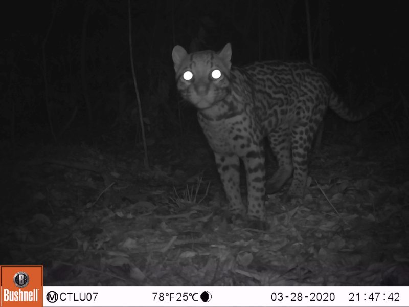

# There are no APIs in the API folder

...anymore.

This folder previously hosted source for a Flask-based real-time API and an Azure-batch-based batch API, but since neither were being actively maintained (or used), they've been removed.  So what's left here is just miscellaneous documentation.  This folder will be removed in a future cleanup.

### Gratuitous camera trap picture

 Image credit University of Minnesota, from the [Orinoquía Camera Traps](http://lila.science/datasets/orinoquia-camera-traps/) data set.

