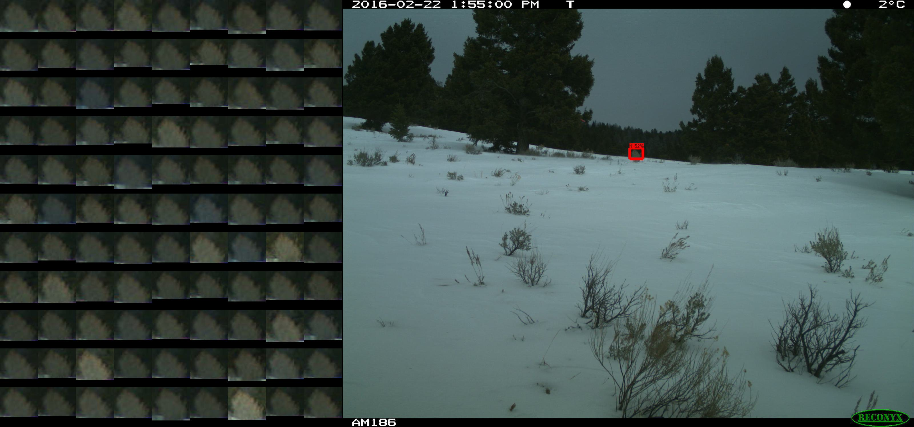

# Overview

We like to think MegaDetector is pretty good at what it does, but we admit it's not perfect: inevitably, we see some "false positives", i.e. pesky branches, piles of snow, or roadside litter that our model thinks is an animal.  As with <i>all</i> object detection models, you can reduce your false positive rate by raising your detection threshold, but if you raise it too high, you risk missing objects you care about.

One of the things we can take advantage of for camera traps, though, is the fact that cameras typically take thousands of images from the same perspective, and if a detector thinks that branch is an animal in one image, it probably identifies the same branch in <i>hundreds</i> of other images.  If <i>exactly the same bounding box</i> is predicted on many images, we call that a <i>suspicious detection</i>.

Suspicious detections aren't always false positives though: sleeping animals can occur in many images without moving an inch, and sometimes cameras on trails frequently have humans entering from the same spot, so we might see thousands of legitimate detections around that spot, and some of them are bound to be about the same size.

Consequently, we have a set of scripts that:

1. Identifies "suspicious detections"
2. Makes it easy for a human to very efficiently review just a small fraction of those images to see which ones are really false positives
3. Removes the false positives from a result set

This whole process can eliminate tens of thousands of false detections with just a few minutes of human review.

This document shows you how to run these scripts.

<b>None of this is required</b>; you can work with MegaDetector results without doing this step.  In fact, we only usually recommend this if you have (a) lots of images (millions) and (b) a reasonably high rate of false positives.  But if you have (a) and (b), this process may save you lots of time!

# Prerequisites

The instructions on this page assume that:

1. You've followed the [MegaDetector environment setup instructions], and that you're at your Mambaforge prompt, in the root folder of the MegaDetector repo.
2. You have a .json file that was produced by [run_detector_batch.py](https://github.com/agentmorris/MegaDetector/blob/main/detection/run_detector_batch.py). 
3. Your images are organized such that all the images from the same camera are in the same folder. For example, if you have images in `c:\my_images\2019\B1`, everything in `B1` comes from the same caemra.  This matters because we won't even compare images in this folder to images in `c:\my_images\2019\A1`.

It's OK if a "camera" folder is some distance away from the bottom of your folder hierarchy.  So, for example, if the folders `c:\my_images\2019\B1\RECNYX100` and `c:\my_images\2019\B1\RECNYX101` are from the same camera, that's OK.  If you do nothing special about this, nothing bad will happen, though you will lose some opportunity to find repeat detections that span those two folders.  We won't get into this in detail on this page, but in this case, you can use the `--nDirLevelsFromLeaf` option to tell the scripts that you want to call the `B1` folder a camera in this case (one folder level up from the bottom), rather than the lowest-level folders.

# Finding suspicious detections

The first step is to find all the detections that are suspicious, i.e. cases where the same detection is repeated a bunch of times.  For this step, you will use [find_repeat_detections.py](https://github.com/agentmorris/MegaDetector/blob/main/api/batch_processing/postprocessing/repeat_detection_elimination/find_repeat_detections.py)

This script is going to generate a bunch of temporary images that you will look at to quickly identify which are actually false positives.

So let's assume that:

* Your .json results file is in `c:\my_results.json`
* You want all the temporary images to end up under `c:\repeat_detection_stuff`
* Your original images are in `c:\my_images`
* Your command prompt is currently in the MegaDetector repository root

You would run:

`python api/batch_processing/postprocessing/find_repeat_detections.py "c:\my_results.json" --imageBase "c:\my_images" --outputBase "c:\repeat_detection_stuff"`

This script can take a while!  Possibly hours if you have millions of images, typically just a few minutes if you only have tens of thousands of images.  If you want to test it on just a couple folders first, you can use the `--debugMaxDir` option, to tell the script to only process a certain number of cameras.

There are lots of other options to this script; we'll talk about them later.  They all relate to the things you can do to make the basic process even more efficient by controlling what gets identified as "suspicious".

# Cleaning up the suspicious detections that were, in fact, things you care about (like animals)

When the script finishes, you'll have a folder called something like `filtering_2023.05.24.13.40.45` inside the main output folder you specified above.  For example, using our running example, this might be at:

`c:\repeat_detection_stuff\filtering_2023.05.24.13.40.45`

This folder will have lots of pictures with bounding boxes on them.  Importantly, you are not looking at <i>every</i> detection; each one of these images represents potentially very many nearly-identical detections.  Even though you're doing some manual work here, machine learning is saving you lots of time!

<b>tl;dr for this whole section: deleting one of these images tells this process that the thing in the red box was actually an animal/person/vehicle. Leaving an image in the folder tells this process that the thing in the red box was indeed a false detection (rock, stick, etc.).</b>

Most of these images indeed correspond to repeated false positives:

&nbsp;&nbsp;&nbsp;&nbsp;&nbsp;&nbsp; 

<b>You don't need to delete the above image; just leave it in the folder.</b>

But some are just animals that aren't moving much:

&nbsp;&nbsp;&nbsp;&nbsp;&nbsp;&nbsp; 

<b>You should delete the above image.</b>

Anything left in this folder will be considered a false positive and removed from your results in subsequent steps, so the next task is to <i>delete all the images in this folder that have bounding boxes on actual objects of interest: animals, people, or vehicles</i>.

Note that it's common to have a false positive in an image that also has an animal in it; you can safely leave these in the folder (telling the scripts that this is indeed a false positive), because these scripts operate on individual <i>detections</i>, not <i>images</i>.  So the following image is safe to leave in place, and you'll be telling the script that the box is a false positive, but you <i>won't</i> be telling it that the elk is a false positive:

&nbsp;&nbsp;&nbsp;&nbsp;&nbsp;&nbsp; 

<b>You don't need to delete the above image; just leave it in the folder.</b>

Sometimes it's actually distracting when an obvious animal like the one in the above image <i>doesn't</i> have a box around it; even though the big red box is only being used to highlight the suspicious detection, <i>not</i> seeing a box on an obvious animal can feel like MegaDetector is missing things.  So, depending on the options you choose, you can have very light gray boxes put around detections <i>other</i> than the one we're actually evaluating, just to give us some comfort that the animal was found, like so:

&nbsp;&nbsp;&nbsp;&nbsp;&nbsp;&nbsp; 

You may not even be able to see the gray box if you're viewing this on GitHub, but if you [open the image directly](https://raw.githubusercontent.com/agentmorris/MegaDetector/main/api/batch_processing/postprocessing/images/gray_box.jpg), you'll see a thin gray line around the elk.  The thick red box is the one we're interested in, so the elk doesn't matter here.

<b>You don't need to delete the above image; just leave it in the folder.</b>

Every once in a while you'll see a box that's <i>partially</i> on an animal.  This is <i>probably</i> a false positive that happened to also include an animal, but if it's a close call, the conservative thing to do is always to delete this image, rather than leaving it in the folder.  This will tell the next set of scripts that this box was a real animal. Example:

&nbsp;&nbsp;&nbsp;&nbsp;&nbsp;&nbsp; 

<b>This is a gray area, but the conservative thing to do is to delete this image.</b>

You can do this step (deleting images) using any tool you like, but for the author's two cents, I really like having two windows open:

1. The regular Windows Explorer with "view" set to "extra large icons".
2. [IrfanView](https://www.irfanview.com), which is a simple, fast image viewer that makes it very quick to page through lots and lots of images in a row that are all just branches and leaves (by pressing or holding down the "right" key).  You can just press the "delete" key in IrfanView to delete an image when you see an animal/person.  This makes things very fast!  I recommend literally having one hand on "page down" and the other on "delete".  (IrfanView is Windows-only, FWIW I use [Viewnior](https://github.com/hellosiyan/Viewnior) when I do this in a Linux environment.)

Remember that in the next step, we'll be marking any detections left in this folder as false positives, so you probably won't see any of these images again.  <b>So make sure to delete all the images that have big red boxes on stuff you care about!</b>

# Producing the final "filtered" output file

When that directory contains only false positives, you're ready to remove those - and the many many images of the same detections that you never had to look at - from your results.  To do this, you'll use [remove_repeat_detections.py](https://github.com/agentmorris/MegaDetector/blob/main/api/batch_processing/postprocessing/repeat_detection_elimination/remove_repeat_detections.py)

The syntax is:

`python remove_repeat_detections.py [inputFile] [outputFile] [filteringFolder]`

So specifically, in our running example, to take the original `my_results.json` file and produce a new `my_results_filtered.json` file with the repeat detections removed, you would run:

`python api/batch_processing/postprocessing/remove_repeat_detections.py "c:\my_results.json" "c:\my_results_filtered.json" "c:\repeat_detection_stuff\filtering_something_something"`

The "something_something" part at the end refers to the exact folder name, which includes some date and time information, so this might actually look like:

`python api/batch_processing/postprocessing/remove_repeat_detections.py "c:\my_results.json" "c:\my_results_filtered.json" "c:\repeat_detection_stuff\filtering_2019.10.24.16.52.54"`

This script takes your original .json file and removes detections corresponding to the stuff you left in the folder in the previous step.  Actually, it doesn't technically remove them; rather, it sets their probabilities to be negative numbers.  So it's possible in downstream processing tools to figure out which things were "removed" by this process.

# What next?

After running this process, you still have a .json file in the standard MegaDetector resultsformat, just with (hopefully) many fewer false positives that are above your confidence threshold.  At this point, you can proceed with whatever workflow you would normally use to work with our API output, e.g. our <a href="https://github.com/agentmorris/MegaDetector/blob/main/api/batch_processing/integration/timelapse.md">integration with Timelapse</a>.

# Visualizing the stuff you're throwing away

When you see a red box on a rock and you <i>don't</i> delete that image, you're making a judgement call that all the other detections that appear in more or less exactly that same spot are also that same rock.  But you're always taking a small risk that an animal happened to line itself up <i>just so</i> at some point, i.e. that it lined up <i>exactly</i> with that rock, in which case suppressing the potentially hundreds of repetitions of that rock could also suppress that animal.  With a sufficiently high IoU threshold (more on this below, but basically, how similar two boxes need to be to be considered the same) and a sufficiently high occurrence threshold (more in this below, but basically, the number of times a detection has to occur to be "suspicious"), the risk is low.  But it's not zero!

Ergo, we've recently added a neat new feature (thanks, [Doantam](https://www.linkedin.com/in/doantam-phan/)!) that lets you visualize a grid of many (possibly all) of the detections that were identical to the one in the red box.  This lets you quickly see what you're throwing away when you <i>don't</i> delete one of these images.  We will probably make this the default at some point, because it's super-duper-useful, but we don't like to rock the boat.  For now, you can enable this with the `--renderDetectionTiles` option.

Here's an example where you can see in just a glance that all 99 instances of this detection are exactly the same bush:

&nbsp;&nbsp;&nbsp;&nbsp;&nbsp;&nbsp; 
&nbsp;&nbsp;&nbsp;&nbsp;&nbsp;&nbsp;(<a href="https://raw.githubusercontent.com/agentmorris/MegaDetector/main/api/batch_processing/postprocessing/images/rde_tiles_all_fps.jpg">direct image link</a>)

This one is more interesting: the red box is on an animal (the back of an elk), but we can see that the other 123 detections at the same location are all the same bush.  Also note the "bonus elk", with the usual light gray box.  It's not a coincidence that the first one is the only real animal; for exactly this reason, the "primary" image (the one you would see in all the examples earlier on this page) is always the one with the highest-confidence detection at the boxed location.

&nbsp;&nbsp;&nbsp;&nbsp;&nbsp;&nbsp; 
&nbsp;&nbsp;&nbsp;&nbsp;&nbsp;&nbsp;(<a href="https://raw.githubusercontent.com/agentmorris/MegaDetector/main/api/batch_processing/postprocessing/images/rde_tiles_primary_tp.jpg">direct image link</a>)

You can see right away that this one is an elk that just sat in one spot for long time, and was detected in 146 images:

&nbsp;&nbsp;&nbsp;&nbsp;&nbsp;&nbsp; 
&nbsp;&nbsp;&nbsp;&nbsp;&nbsp;&nbsp;(<a href="https://raw.githubusercontent.com/agentmorris/MegaDetector/main/api/batch_processing/postprocessing/images/rde_tiles_sleeping_elk.jpg">direct image link</a>)

This is the pathological case we're looking for... the sample image for this detection has a red box on a rock, so if you weren't seeing the grid, you would treat this as a false detection.  And most of the detections at this location are the same rock, but one image has an elk at exactly that location.  If it makes you feel better, though, it took me <i>forever</i> to find an image that illustrated this case (seriously, forever), and I had to use parameters I probably wouldn't have used in a real RDE pass to force the issue.  But it's a real risk!

&nbsp;&nbsp;&nbsp;&nbsp;&nbsp;&nbsp; 
&nbsp;&nbsp;&nbsp;&nbsp;&nbsp;&nbsp;(<a href="https://raw.githubusercontent.com/agentmorris/MegaDetector/main/api/batch_processing/postprocessing/images/rde_tiles_hidden_tp.jpg">direct image link</a>)

This one isn't illustrating anything at all, it just looks cool:

&nbsp;&nbsp;&nbsp;&nbsp;&nbsp;&nbsp; 
&nbsp;&nbsp;&nbsp;&nbsp;&nbsp;&nbsp;(<a href="https://raw.githubusercontent.com/agentmorris/MegaDetector/main/api/batch_processing/postprocessing/images/rde_tiles_cool_image.jpg">direct image link</a>)

All of these sample images (for the tiling feature) came from the <a href="https://lila.science/datasets/idaho-camera-traps/">Idaho Camera Traps</a> dataset.

# Advanced options

There are a few magic numbers involved in identifying "suspicious" detections.  You can tune these to identify more or fewer detections as suspicious, depending on how it's performing on your data and how much time you want to spend reviewing.

You can run:

`python api/batch_processing/postprocessing/find_repeat_detections.py`

...for a full list of options and documentation for each, but some specific options of interest.

These are the two options we most frequently tinker with when running this process:

* `--occurrenceThreshold` controls how many times a detection needs to be seen to be considered suspicious.  Defaults to 20; for very large datasets, I'll often set this as high as 75.
* `--confidenceMin` is a way of not wasting time on things you were going to throw out anyway, by telling the scripts not to even consider low-confidence detections as suspicious.  Defaults to 0.1, but if you are likely to use a confidence threshold that's close to or below 0.1 (which is on the low side), you might want to lower this to something more like 0.08.

These options are a little more for power users (which is saying something, since if you're reading this page, you're a <i>serious</i> MegaDetector power user):

* `--maxSuspiciousDetectionSize` puts a limit on how large a suspicious box can be: sometimes animals take up the whole image, and by definition you get the same box for every animal that takes up the whole image.  Defaults to 0.2 (one-fifth of the image size).
* `--confidenceMax` is a way of telling the script not to consider anything that's very high confidence as suspicious.  This defaults to 1.0, meaning even a box with confidence 0.99999 could be treated as suspicious.
* `--iouThreshold` controls exactly how similar two boxes have to be in order to be considered "identical".  If you show any detector nearly identical images with just a couple pixels of difference between them, the resulting bounding boxes may move around a bit.  A value of 1.0 (which you shouldn't use) says that two boxes have to be <i>identical</i> to be considered repeats.  Lowering this value will collapse more detections into a single example detection, but if you lower this too far, any two boxes would be considered identical, and you'll start treating totally separate detections as identical.  Defaults to 0.9.

# Another way to do all of this

Breaking the fourth wall for a minute, and speaking as <a href="http://dmorris.net">Dan</a>, rather than "we".  I have run this process seventy-zillion times, but I've never actually run it with the command line tools I talk about here.  I always run this process as part of the [manage_local_batch.py](https://github.com/agentmorris/MegaDetector/blob/main/api/batch_processing/data_preparation/manage_local_batch.py) workflow ([notebook version](https://github.com/agentmorris/MegaDetector/blob/main/api/batch_processing/data_preparation/manage_local_batch.ipynb)), where I'm carrying my data set through a bunch of steps, one of which is RDE (repeat detection elimination), so I actually invoke all these scripts from Python.  If you're enough of a MegaDetector power user to be reading this far down this page, I can't recommend this workflow enough: you don't want to be running every step in your workflow at the command line.  You can read a little more about this workflow [here](https://github.com/agentmorris/MegaDetector/blob/main/megadetector.md#ok-but-is-that-how-the-md-devs-run-the-model), and you can always [email me](mailto:cameratraps@lila.science) with questions.

